# Diagramas da Arquitetura - Sistema Vida Mais

## 1. Arquitetura de Alto Nível

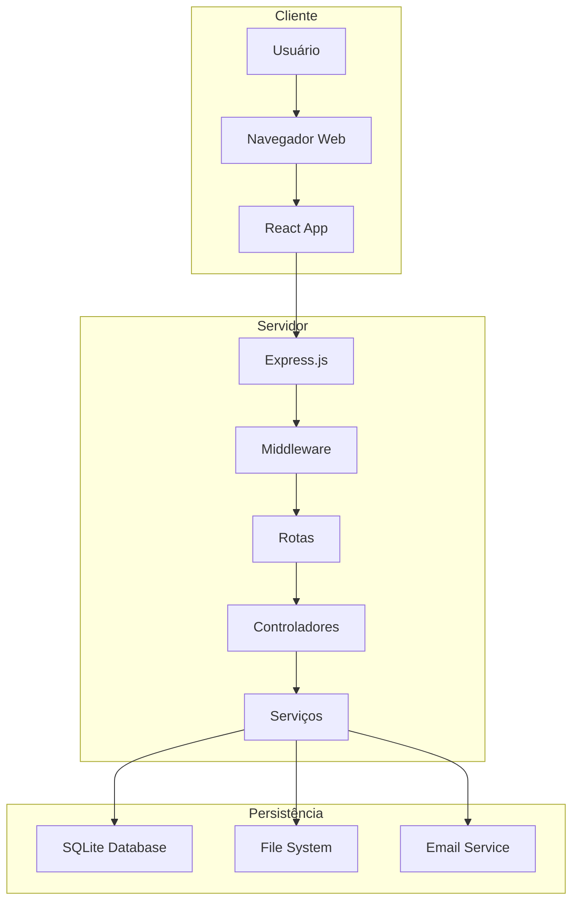

## 2. Fluxo de Autenticação

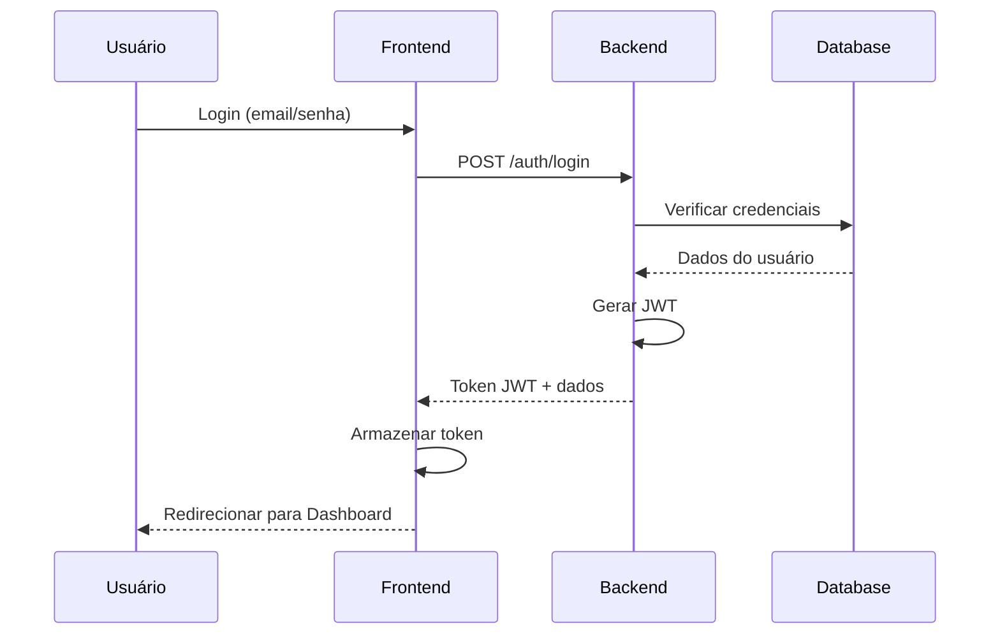

## 3. Fluxo de Criação de Pagamento

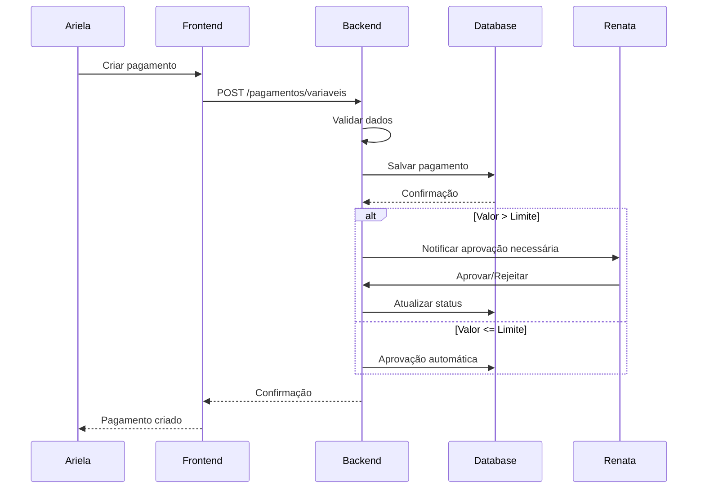

## 4. Estrutura de Banco de Dados

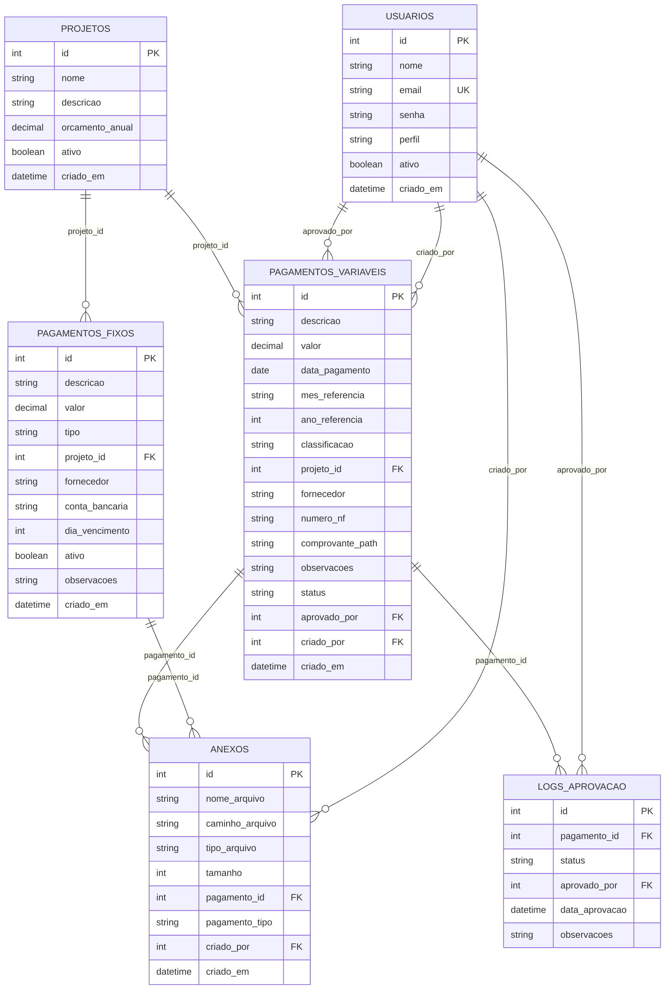

## 5. Arquitetura de Segurança

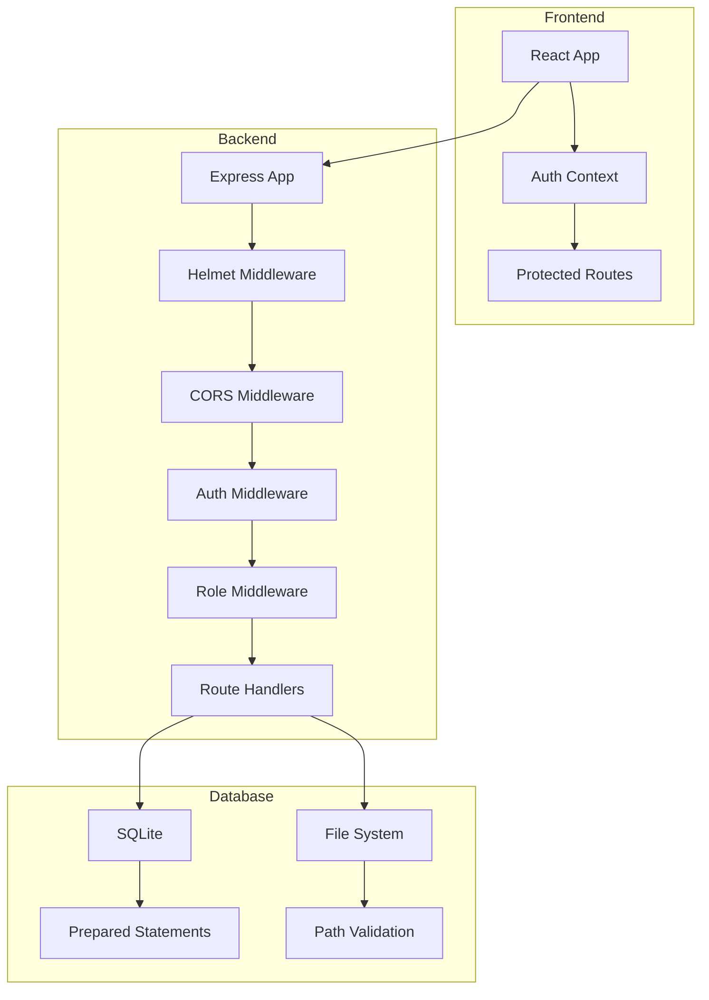

## 6. Fluxo de Relatórios

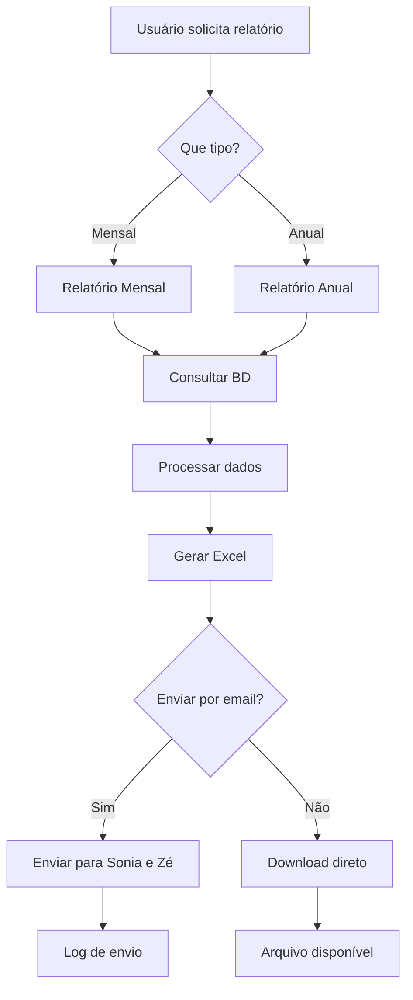

## 7. Estrutura de Componentes React

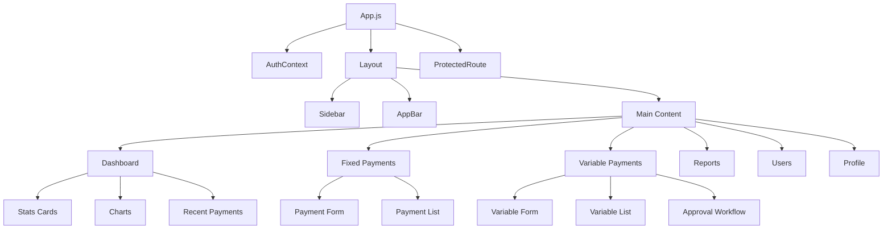

## 8. Padrões de Middleware

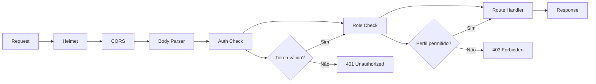

## 9. Estratégia de Backup

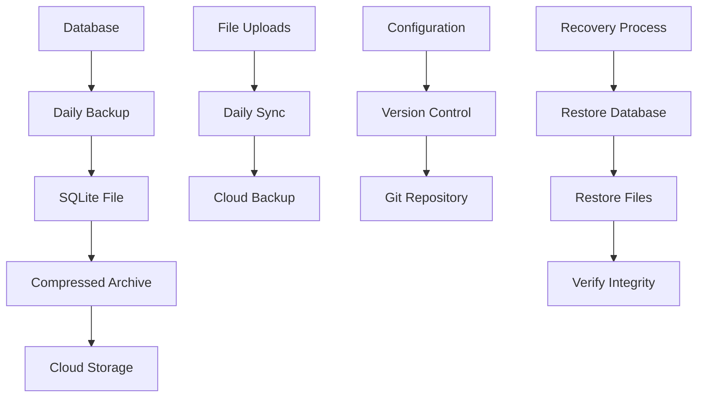

## 10. Monitoramento e Métricas

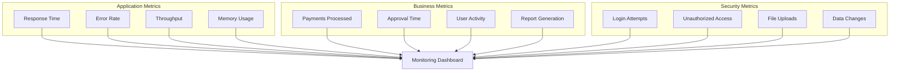

## 11. Fluxo de Aprovação

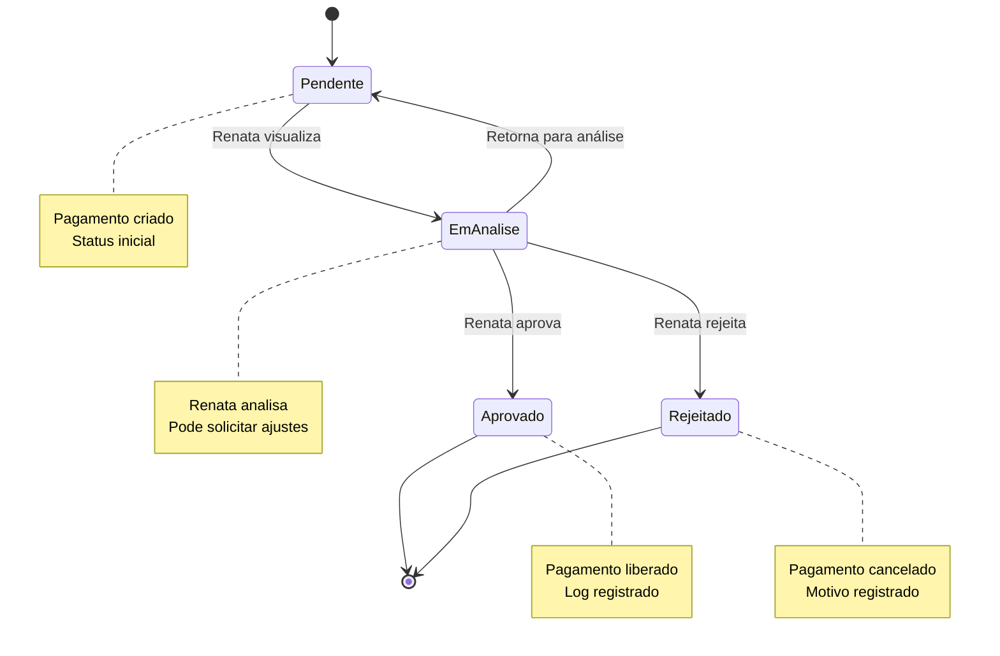

## 12. Estrutura de Arquivos

```
vida-mais-pagamentos/
├── client/                          # Frontend React
│   ├── public/
│   │   ├── index.html
│   │   └── favicon.ico
│   ├── src/
│   │   ├── components/              # Componentes reutilizáveis
│   │   │   ├── Auth/               # Autenticação
│   │   │   ├── Layout/             # Layout principal
│   │   │   ├── Dashboard/          # Dashboard
│   │   │   ├── Payments/           # Pagamentos
│   │   │   ├── Reports/            # Relatórios
│   │   │   └── Users/              # Gestão de usuários
│   │   ├── contexts/               # Contextos React
│   │   ├── services/               # Serviços de API
│   │   ├── utils/                  # Utilitários
│   │   ├── App.js                  # Componente principal
│   │   └── index.js                # Ponto de entrada
│   ├── package.json
│   └── README.md
├── server/                          # Backend Node.js
│   ├── database/                    # Banco de dados
│   │   ├── init.js                  # Inicialização
│   │   └── vida-mais.db            # Arquivo SQLite
│   ├── middleware/                  # Middleware
│   │   └── auth.js                  # Autenticação
│   ├── routes/                      # Rotas da API
│   │   ├── auth.js                  # Autenticação
│   │   ├── pagamentos.js            # Pagamentos
│   │   ├── usuarios.js              # Usuários
│   │   ├── relatorios.js            # Relatórios
│   │   └── upload.js                # Upload de arquivos
│   ├── uploads/                     # Arquivos enviados
│   ├── index.js                     # Servidor principal
│   ├── package.json
│   └── README.md
├── docs/                            # Documentação
│   ├── ARQUITETURA.md               # Este arquivo
│   ├── DIAGRAMAS.md                 # Diagramas
│   └── INSTALACAO.md                # Guia de instalação
├── .env.example                     # Variáveis de ambiente
├── .gitignore                       # Arquivos ignorados pelo Git
├── package.json                     # Configuração principal
└── README.md                        # Documentação principal
```
