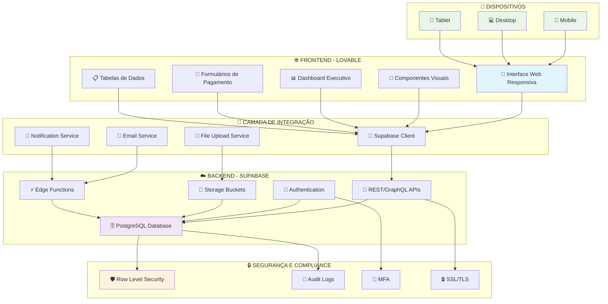
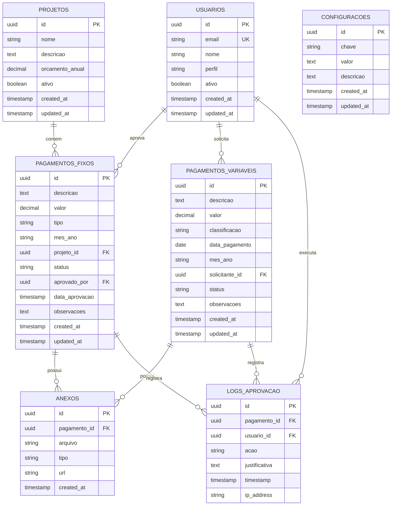
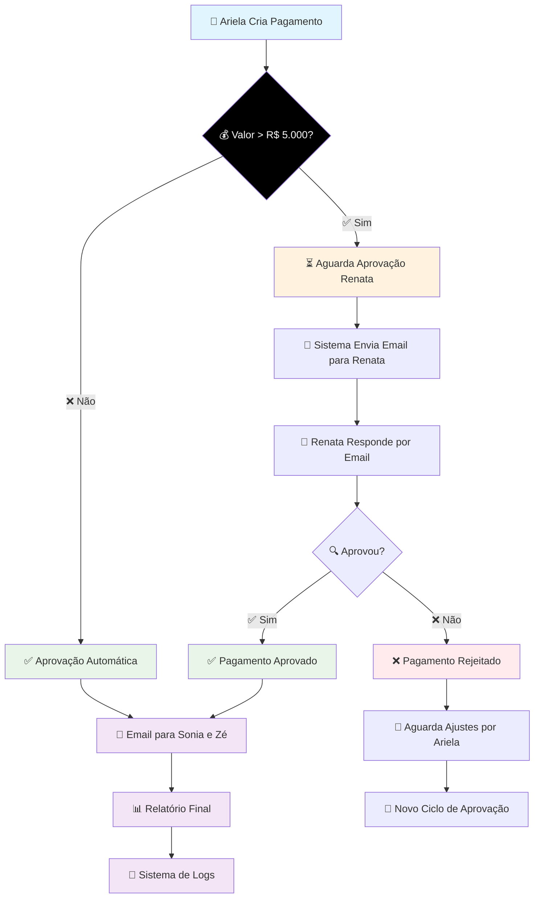
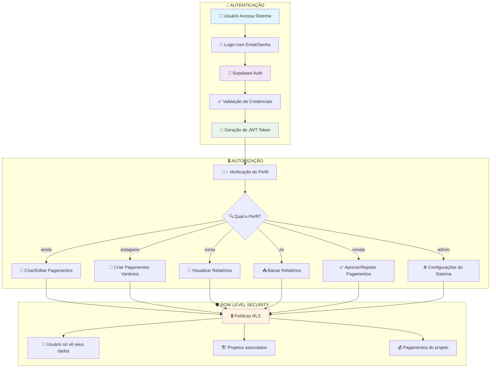
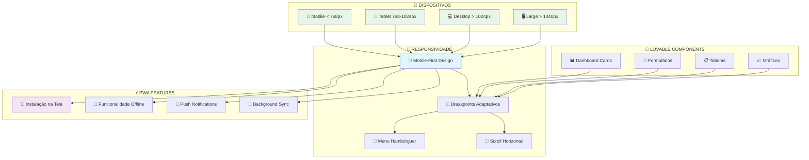
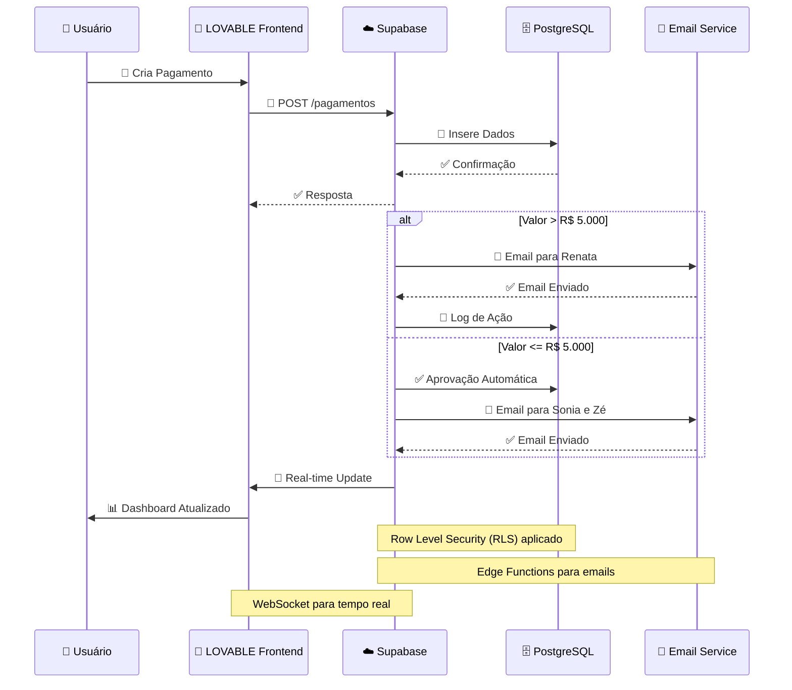
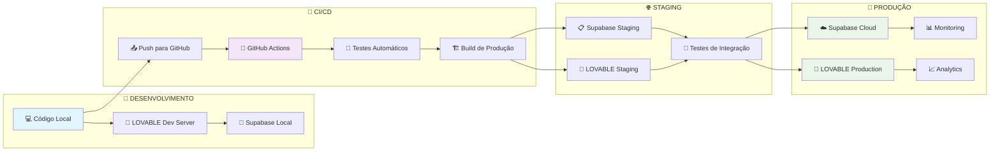
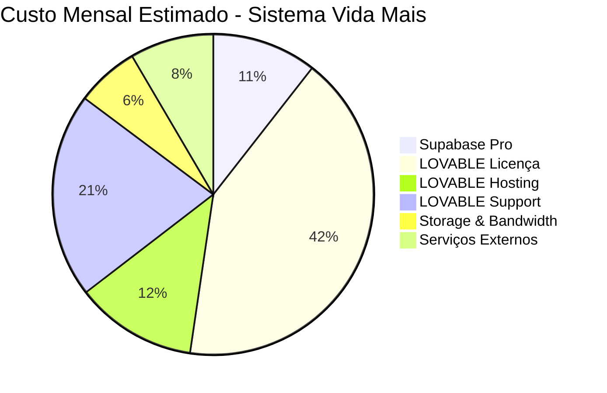
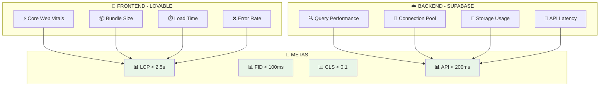
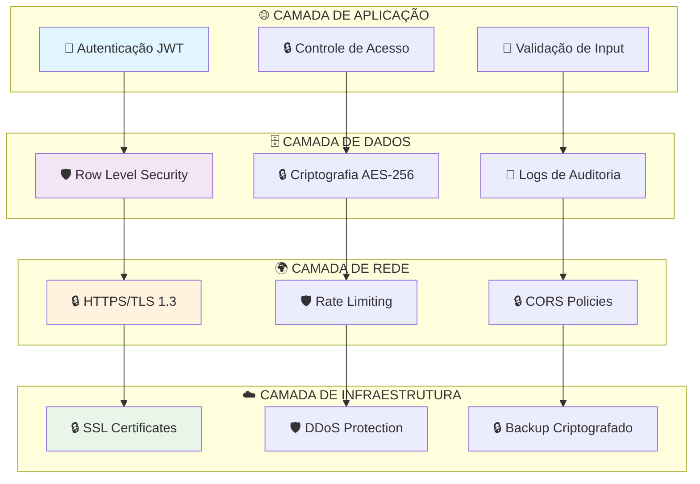

# 🎨 **DIAGRAMAS DE ARQUITETURA - SISTEMA VIDA MAIS**

## 🏗️ **VISÃO GERAL DA ARQUITETURA**

Este documento contém diagramas visuais da arquitetura do Sistema Vida Mais, mostrando a integração entre **LOVABLE** (Frontend) e **Supabase** (Backend).

---

## 🔄 **DIAGRAMA 1: ARQUITETURA GERAL DO SISTEMA**

---

## 🗄️ **DIAGRAMA 2: ESTRUTURA DO BANCO DE DADOS**

---

## 🔄 **DIAGRAMA 3: FLUXO DE APROVAÇÃO DE PAGAMENTOS**

---

## 🔐 **DIAGRAMA 4: SISTEMA DE AUTENTICAÇÃO E AUTORIZAÇÃO**

---

## 📱 **DIAGRAMA 5: ARQUITETURA RESPONSIVA E PWA**

---

## 🔄 **DIAGRAMA 6: FLUXO DE DADOS EM TEMPO REAL**

---

## 🚀 **DIAGRAMA 7: PIPELINE DE DEPLOYMENT**

---

## 💰 **DIAGRAMA 8: ESTRUTURA DE CUSTOS**

---

## 📊 **DIAGRAMA 9: MÉTRICAS DE PERFORMANCE**

---

## 🔒 **DIAGRAMA 10: CAMADAS DE SEGURANÇA**

---

## 🎯 **RESUMO DOS DIAGRAMAS**

### **1. Arquitetura Geral** - Visão macro do sistema
### **2. Estrutura do Banco** - Modelo de dados completo
### **3. Fluxo de Aprovação** - Processo de negócio principal
### **4. Autenticação** - Sistema de segurança e permissões
### **5. Responsividade** - Adaptação para diferentes dispositivos
### **6. Fluxo de Dados** - Comunicação em tempo real
### **7. Pipeline de Deploy** - Processo de desenvolvimento
### **8. Estrutura de Custos** - Análise financeira
### **9. Métricas de Performance** - Indicadores de qualidade
### **10. Camadas de Segurança** - Proteção em múltiplas camadas

---

## 🎨 **COMO USAR OS DIAGRAMAS**

1. **Copie o código Mermaid** de cada diagrama
2. **Cole em ferramentas que suportam Mermaid**:
   - GitHub (Markdown)
   - GitLab
   - Notion
   - Mermaid Live Editor
   - VS Code com extensão Mermaid

3. **Personalize cores e estilos** conforme necessário
4. **Exporte como imagem** para apresentações

---

**📋 Documento criado em: Janeiro de 2025**  
**🎨 Responsável: Diagramas de Arquitetura Vida Mais**  
**📧 Contato: architecture@vidamais.com**
