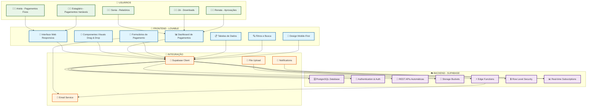

# 🛠️ **DIAGRAMA DE FERRAMENTAS - LOVABLE + SUPABASE**

## 🎯 **SISTEMA DE PAGAMENTOS VIDA MAIS**

Este diagrama mostra como as ferramentas **LOVABLE** e **Supabase** se integram para criar o sistema de pagamentos completo.

---

## 🔗 **DIAGRAMA DE ARQUITETURA DAS FERRAMENTAS**

---

## 🎨 **LOVABLE - FRONTEND LOW-CODE**

### **📱 Interface Web Responsiva**
- **Responsividade**: Adapta-se a todos os dispositivos
- **Temas**: Design system consistente
- **Acessibilidade**: WCAG 2.1 compliance

### **🎨 Componentes Visuais Drag & Drop**
- **Formulários**: Campos de entrada personalizáveis
- **Tabelas**: Grids com paginação e filtros
- **Gráficos**: Charts interativos para métricas
- **Botões**: Ações e navegação intuitiva

### **📊 Dashboard de Pagamentos**
- **Cards**: Métricas em tempo real
- **Gráficos**: Pagamentos por mês/status
- **Alertas**: Notificações visuais
- **Resumo**: Visão geral dos dados

### **📝 Formulários de Pagamento**
- **Validação**: Campos obrigatórios e regras
- **Upload**: Anexar arquivos e documentos
- **Autocomplete**: Sugestões inteligentes
- **Multi-step**: Processo guiado

### **📋 Tabelas de Dados**
- **Paginação**: Navegação por páginas
- **Ordenação**: Por colunas específicas
- **Filtros**: Busca avançada
- **Export**: Excel, CSV, PDF

### **🔍 Filtros e Busca**
- **Texto**: Busca por descrição
- **Data**: Períodos específicos
- **Valor**: Faixas de valores
- **Status**: Pendente, aprovado, rejeitado

### **📱 Design Mobile-First**
- **Touch**: Interface otimizada para toque
- **Responsivo**: Adapta-se a telas pequenas
- **PWA**: Funciona offline
- **Performance**: Carregamento rápido

---

## ☁️ **SUPABASE - BACKEND AS A SERVICE**

### **🗄️ PostgreSQL Database**
- **Tabelas**: usuarios, projetos, pagamentos, anexos
- **Relacionamentos**: Foreign keys e joins
- **Índices**: Performance otimizada
- **Backup**: Automático e diário

### **🔐 Authentication & Auth**
- **Login**: Email/senha seguro
- **JWT**: Tokens de sessão
- **Perfis**: Controle de acesso granular
- **MFA**: Autenticação de dois fatores

### **📡 REST APIs Automáticas**
- **CRUD**: Create, Read, Update, Delete
- **Filtros**: WHERE, ORDER BY, LIMIT
- **Relacionamentos**: Joins automáticos
- **Validação**: Regras de negócio

### **💾 Storage Buckets**
- **Arquivos**: PDFs, imagens, documentos
- **Organização**: Por tipo e pagamento
- **Segurança**: Acesso controlado
- **CDN**: Distribuição global

### **⚡ Edge Functions**
- **Emails**: Notificações automáticas
- **Processamento**: Lógica de negócio
- **Webhooks**: Integrações externas
- **Performance**: Execução na edge

### **🔒 Row Level Security**
- **Políticas**: Controle de acesso por usuário
- **Perfis**: Diferentes níveis de acesso
- **Dados**: Filtrados automaticamente
- **Auditoria**: Log de todas as ações

### **📊 Real-time Subscriptions**
- **Atualizações**: Dados em tempo real
- **Notificações**: Mudanças instantâneas
- **Dashboard**: Métricas atualizadas
- **Colaboração**: Múltiplos usuários

---

## 🔗 **INTEGRAÇÃO ENTRE FERRAMENTAS**

### **🔌 Supabase Client**
- **Conexão**: Configuração automática
- **Queries**: Linguagem SQL familiar
- **Cache**: Dados em memória local
- **Offline**: Funciona sem internet

### **📧 Email Service**
- **Templates**: HTML responsivo
- **Destinatários**: Sonia, Zé, Renata
- **Triggers**: Eventos automáticos
- **Histórico**: Log de envios

### **📁 File Upload**
- **Drag & Drop**: Interface intuitiva
- **Validação**: Tipos de arquivo
- **Progress**: Barra de upload
- **Preview**: Visualização antes do envio

### **🔔 Notifications**
- **Push**: Notificações em tempo real
- **Email**: Resumos diários
- **SMS**: Alertas urgentes
- **In-app**: Mensagens na interface

---

## 👥 **PERFIS DE USUÁRIO**

### **👩‍💼 Ariela - Pagamentos Fixos**
- **Acesso**: Criar/editar pagamentos fixos
- **Funcionalidades**: Upload de NFs, anexos
- **Interface**: Formulários simplificados

### **👨‍🎓 Estagiário - Pagamentos Variáveis**
- **Acesso**: Apenas pagamentos variáveis
- **Funcionalidades**: Formulários básicos
- **Interface**: Campos essenciais

### **👩‍💻 Sonia - Relatórios**
- **Acesso**: Visualizar relatórios
- **Funcionalidades**: Dashboard executivo
- **Interface**: Métricas e gráficos

### **👨‍💼 Zé - Downloads**
- **Acesso**: Visualizar e baixar relatórios
- **Funcionalidades**: Export Excel/CSV
- **Interface**: Tabelas com filtros

### **👩‍💼 Renata - Aprovações**
- **Acesso**: Aprovar/rejeitar pagamentos
- **Funcionalidades**: Interface de decisão
- **Interface**: Detalhes completos

---

## 🚀 **VANTAGENS DA INTEGRAÇÃO**

### **✅ LOVABLE**
- **Rápido**: Interface em poucos dias
- **Visual**: Drag & drop intuitivo
- **Responsivo**: Mobile-first design
- **Customizável**: Componentes adaptáveis

### **✅ Supabase**
- **Pronto**: Backend completo
- **Seguro**: RLS e autenticação
- **Escalável**: PostgreSQL robusto
- **Real-time**: Atualizações instantâneas

### **✅ Integração**
- **Simples**: Conexão direta
- **Eficiente**: APIs otimizadas
- **Confiável**: Infraestrutura gerenciada
- **Econômico**: Sem servidores próprios

---

## 🎯 **RESULTADO FINAL**

Com **LOVABLE + Supabase**, você terá:

🚀 **Sistema completo** em 4 semanas  
🎨 **Interface profissional** e responsiva  
☁️ **Backend robusto** e seguro  
📧 **Emails automáticos** para aprovações  
🔒 **Controle de acesso** granular  
📊 **Relatórios** em tempo real  
📱 **Mobile-first** para todos os usuários  

**🎯 Foco total no sistema de pagamentos, sem complexidades técnicas!**

---

**📋 Documento criado em: Janeiro de 2025**  
**🛠️ Ferramentas: LOVABLE + Supabase**  
**📧 Contato: tools@vidamais.com**
