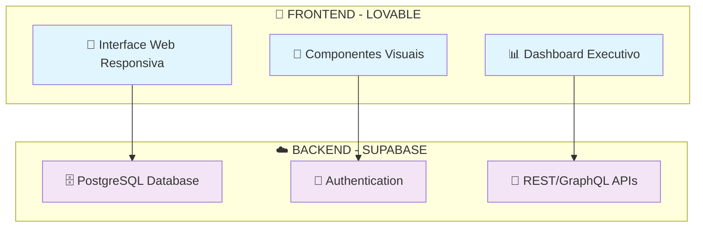

# 🔗 **DIAGRAMA SIMPLES - LOVABLE + SUPABASE**

## 🎯 **SISTEMA DE PAGAMENTOS VIDA MAIS**

Diagrama simplificado mostrando a integração entre as ferramentas **LOVABLE** e **Supabase**.

---

## 🔗 **DIAGRAMA DE ARQUITETURA SIMPLES**

---

## 🎨 **FRONTEND - LOVABLE**

### **📱 Interface Web Responsiva**
- **Responsividade**: Adapta-se a todos os dispositivos
- **Mobile-first**: Design otimizado para mobile
- **Temas**: Design system consistente

### **🎨 Componentes Visuais**
- **Drag & Drop**: Interface intuitiva
- **Formulários**: Campos personalizáveis
- **Tabelas**: Grids com filtros
- **Gráficos**: Charts interativos

### **📊 Dashboard Executivo**
- **Métricas**: Cards com dados em tempo real
- **Gráficos**: Pagamentos por mês/status
- **Alertas**: Notificações visuais

---

## ☁️ **BACKEND - SUPABASE**

### **🗄️ PostgreSQL Database**
- **Tabelas**: usuarios, projetos, pagamentos, anexos
- **Relacionamentos**: Foreign keys automáticos
- **Backup**: Automático e diário

### **🔐 Authentication**
- **Login**: Email/senha seguro
- **JWT**: Tokens de sessão
- **Perfis**: Controle de acesso granular
- **MFA**: Autenticação de dois fatores

### **📡 REST/GraphQL APIs**
- **CRUD**: Create, Read, Update, Delete
- **Filtros**: WHERE, ORDER BY, LIMIT
- **Validação**: Regras de negócio
- **Real-time**: Atualizações instantâneas

---

## 🔗 **INTEGRAÇÃO**

### **Como Funciona:**
1. **LOVABLE** cria a interface visual
2. **Supabase Client** conecta frontend e backend
3. **APIs automáticas** fornecem dados
4. **Autenticação** controla acesso
5. **Database** armazena informações

### **Vantagens:**
✅ **Simples**: Conexão direta  
✅ **Rápido**: Desenvolvimento em 4 semanas  
✅ **Seguro**: RLS e autenticação  
✅ **Escalável**: Infraestrutura gerenciada  

---

## 🎯 **RESULTADO**

**LOVABLE** + **Supabase** = **Sistema de Pagamentos Completo**

- 🚀 **Frontend**: Interface visual em poucos dias
- ☁️ **Backend**: Infraestrutura pronta e segura
- 🔗 **Integração**: Conexão automática e eficiente
- 📱 **Mobile**: Funciona em todos os dispositivos

---

**📋 Documento criado em: Janeiro de 2025**  
**🛠️ Ferramentas: LOVABLE + Supabase**  
**📧 Contato: simple@vidamais.com**
