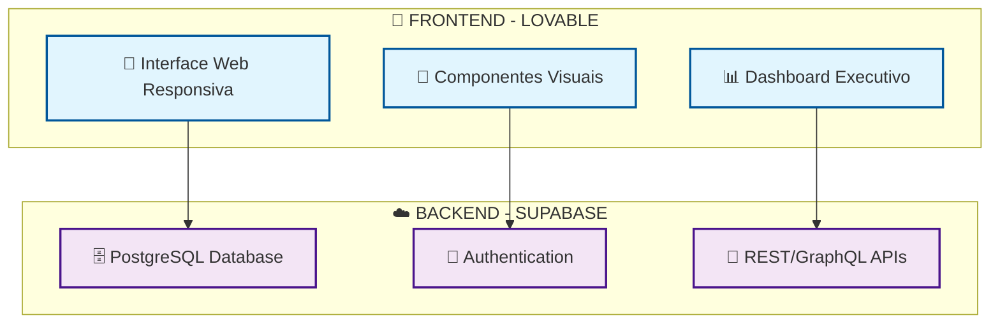

# 🖼️ **DIAGRAMA VISUAL - LOVABLE + SUPABASE**

## 🎯 **SISTEMA DE PAGAMENTOS VIDA MAIS**

Este arquivo contém o diagrama visual que pode ser renderizado em plataformas que suportam Mermaid (GitHub, GitLab, Notion, etc.).

---

## 🔗 **DIAGRAMA DE ARQUITETURA VISUAL**

---

## 📱 **COMO VISUALIZAR:**

### **1. GitHub/GitLab**
- O diagrama será renderizado automaticamente
- Visualize diretamente no arquivo markdown

### **2. Mermaid Live Editor**
- Acesse: https://mermaid.live/
- Cole o código do diagrama
- Veja em tempo real

### **3. VS Code**
- Instale extensão "Mermaid Preview"
- Visualize com Ctrl+Shift+P → "Mermaid Preview"

### **4. Notion**
- Cole o código Mermaid
- Será renderizado automaticamente

---

## 🎨 **COMPONENTES DO DIAGRAMA:**

### **🎨 FRONTEND - LOVABLE**
- **📱 Interface Web Responsiva** → Conecta com Database
- **🎨 Componentes Visuais** → Conecta com Authentication
- **📊 Dashboard Executivo** → Conecta com APIs

### **☁️ BACKEND - SUPABASE**
- **🗄️ PostgreSQL Database** ← Recebe dados da Interface
- **🔐 Authentication** ← Valida Componentes
- **📡 REST/GraphQL APIs** ← Fornece dados para Dashboard

---

## 🔗 **FLUXO DE DADOS:**

1. **Interface Web** → **Database** (CRUD de pagamentos)
2. **Componentes** → **Authentication** (validação de usuários)
3. **Dashboard** → **APIs** (métricas e relatórios)

---

**📋 Arquivo criado para visualização do diagrama**  
**🛠️ Ferramentas: LOVABLE + Supabase**  
**📧 Contato: visual@vidamais.com**
