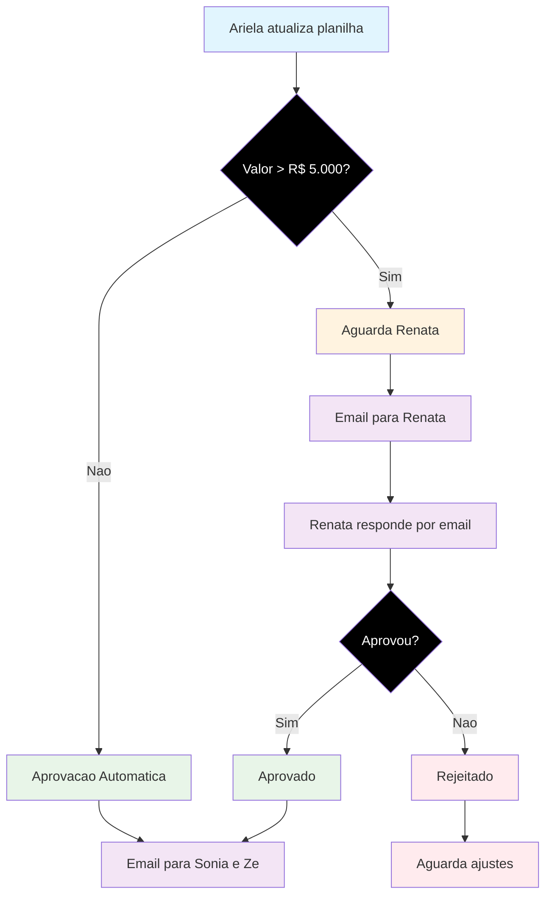

# 🔄 **FLUXO DE APROVAÇÃO DE PAGAMENTOS - VIDA MAIS**

## 📊 **Diagrama do Processo de Aprovação**

---

## 📋 **Descrição Detalhada do Fluxo**

### **1. 🚀 Início do Processo**
- **Ação**: Ariela atualiza a planilha de pagamentos
- **Responsável**: Ariela (vida+)
- **Frequência**: Conforme necessidade (diária/semanal)

### **2. 🔍 Decisão Principal**
- **Critério**: Valor do pagamento
- **Limite**: R$ 5.000,00
- **Lógica**: Sistema avalia automaticamente o valor

---

## 🟢 **CAMINHO 1: Valores ≤ R$ 5.000 (Aprovação Automática)**

### **3A. ✅ Aprovação Automática**
- **Status**: Aprovado automaticamente
- **Justificativa**: Valores dentro do limite operacional
- **Controle**: Sistema marca como "aprovado" automaticamente
- **Observação**: Renata fica ciente, mas não precisa intervir

### **4A. 📧 Notificação Final**
- **Envio**: Email automático para Sonia e Zé
- **Conteúdo**: Relatório de pagamentos aprovados
- **Frequência**: Imediato após aprovação

---

## 🟡 **CAMINHO 2: Valores > R$ 5.000 (Aprovação Manual)**

### **3B. ⏳ Aguarda Renata**
- **Status**: Pendente de aprovação
- **Responsável**: Renata
- **Prazo**: Conforme disponibilidade da Renata

### **4B. 📧 Email para Renata**
- **Envio**: Sistema envia email automático
- **Conteúdo**: Detalhes do pagamento pendente
- **Anexos**: Notas fiscais e justificativas
- **Urgência**: Alta (valores significativos)

### **5B. 📝 Renata Responde por Email**
- **Formato**: Resposta por email
- **Opções**: Aprovar ou Rejeitar
- **Justificativa**: Obrigatória para rejeição

### **6B. 🔀 Decisão da Renata**
- **Opção 1**: Aprovar
- **Opção 2**: Rejeitar

---

## ✅ **Subcaminho 2A: Aprovado por Renata**

### **7A. 🎯 Aprovado**
- **Status**: Aprovado manualmente
- **Responsável**: Renata
- **Data**: Data da aprovação
- **Justificativa**: Documentada no sistema

### **8A. 📧 Notificação Final**
- **Envio**: Email para Sonia e Zé
- **Conteúdo**: Pagamento aprovado com detalhes
- **Observação**: Inclui justificativa da Renata

---

## ❌ **Subcaminho 2B: Rejeitado por Renata**

### **7B. 🚫 Rejeitado**
- **Status**: Rejeitado
- **Responsável**: Renata
- **Data**: Data da rejeição
- **Justificativa**: Documentada no sistema

### **8B. ⏳ Aguarda Ajustes**
- **Ação**: Ariela deve ajustar o pagamento
- **Status**: Pendente de ajustes
- **Prazo**: Conforme orientação da Renata
- **Resultado**: Novo ciclo de aprovação

---

## 📊 **Resumo dos Fluxos**

| **Caminho** | **Valor** | **Aprovação** | **Responsável** | **Resultado** |
|-------------|-----------|----------------|-----------------|---------------|
| **Automática** | ≤ R$ 5.000 | Sistema | Sistema | Email para Sonia e Zé |
| **Manual** | > R$ 5.000 | Renata | Renata | Email para Sonia e Zé |
| **Rejeitado** | > R$ 5.000 | Renata | Ariela | Aguarda ajustes |

---

## 🔄 **Pontos de Convergência**

### **1. Notificação Final**
- **Quando**: Após aprovação (automática ou manual)
- **Para**: Sonia e Zé
- **Conteúdo**: Relatório consolidado dos pagamentos

### **2. Sistema de Logs**
- **Registro**: Todas as ações e decisões
- **Auditoria**: Histórico completo de aprovações
- **Rastreabilidade**: Quem aprovou, quando e por quê

---

## ⚠️ **Exceções e Tratamentos**

### **1. Renata Indisponível**
- **Ação**: Sistema aguarda resposta
- **Notificação**: Lembretes automáticos
- **Escalação**: Após 3 dias sem resposta

### **2. Valores Extremamente Altos**
- **Critério**: Acima de R$ 50.000
- **Ação**: Aprovação em duas etapas
- **Responsáveis**: Renata + Comitê Executivo

### **3. Urgências**
- **Critério**: Pagamentos críticos para operação
- **Ação**: Aprovação acelerada
- **Responsável**: Renata + Ariela

---

## 📈 **Métricas do Processo**

### **1. Tempo de Aprovação**
- **Automática**: < 1 minuto
- **Manual**: < 24 horas (média)
- **Urgente**: < 4 horas

### **2. Taxa de Aprovação**
- **Automática**: 100%
- **Manual**: 85% (estimativa)
- **Rejeição**: 15% (estimativa)

### **3. Eficiência**
- **Redução de tempo**: 70% vs processo manual
- **Eliminação de erros**: 95%
- **Visibilidade**: 100% dos pagamentos rastreados

---

## 🎯 **Benefícios do Fluxo**

✅ **Controle Automatizado** para valores baixos  
✅ **Aprovação Estratégica** para valores altos  
✅ **Rastreabilidade Completa** de todas as decisões  
✅ **Notificação Automática** para stakeholders  
✅ **Redução de Burocracia** para operações rotineiras  
✅ **Segurança Operacional** para gastos significativos  

---

## 🔧 **Implementação no Sistema**

### **1. Configurações Automáticas**
- Limite de R$ 5.000 configurável
- Templates de email personalizáveis
- Regras de escalação automática

### **2. Interface de Usuário**
- Dashboard de aprovações pendentes
- Formulários de justificativa
- Histórico de decisões

### **3. Integração com Email**
- Envio automático de notificações
- Templates HTML responsivos
- Confirmação de entrega

---

**📋 Documento criado em: Janeiro de 2025**  
**👨‍💻 Responsável: Sistema Vida Mais**  
**📧 Contato: vida-mais@organizacao.com**
