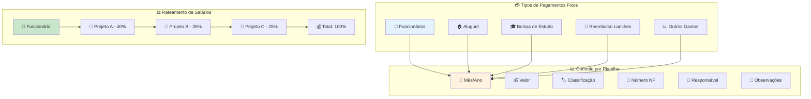
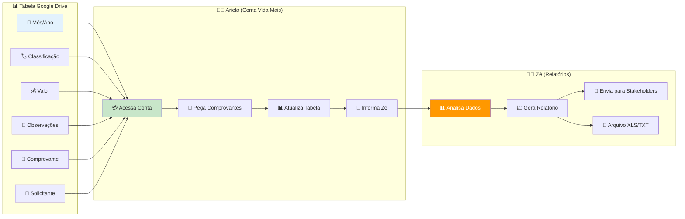
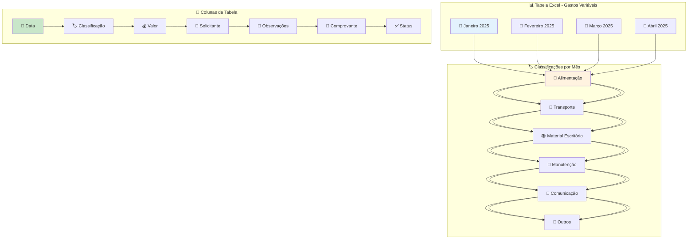
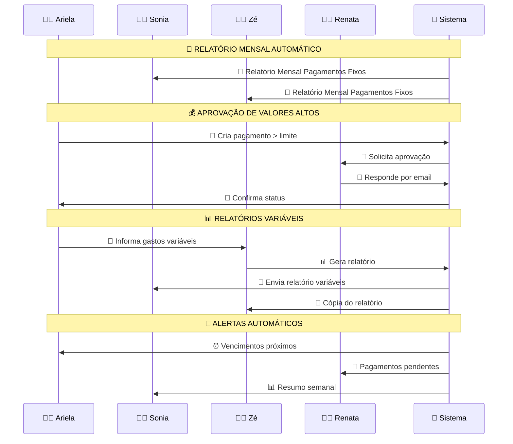
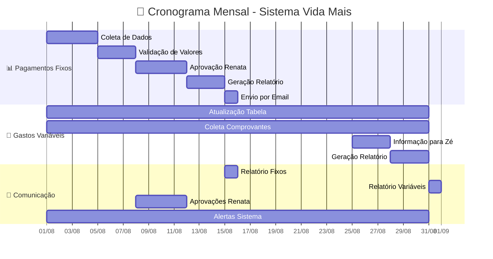

# Fluxo Real do Sistema - Baseado na Pauta da Reunião Vida Mais

## 📅 **Contexto da Reunião**
**Data**: Quinta-feira, 7 de agosto de 2025  
**Participantes**: Aldemar, Nathalia, Emanuel e Ariela (vida+)  
**Data de Resposta**: Semana do dia 22/08 (terceira semana de agosto)

---

## 🎯 **1. Pagamentos Mensais Fixos - Fluxo Principal**

```mermaid
flowchart TD
    A[📊 Planilha de Controle<br/>Pagamentos Fixos] --> B{💰 Valor > Limite<br/>Renata?}
    
    B -->|❌ Não (Reembolso lanches)| C[✅ Aprovação Automática]
    B -->|✅ Sim (Valores altos)| D[⏳ Aguarda Aprovação Renata]
    
    C --> E[📧 Email para Sonia e Zé<br/>Relatório Mensal]
    C --> F[📝 Registra no Sistema<br/>Status: Aprovado]
    
    D --> G[📧 Email para Renata<br/>Solicita Aprovação]
    G --> H[👩‍💼 Renata Analisa<br/>Responde por Email]
    
    H --> I{🔍 Aprova?}
    I -->|✅ Sim| J[✅ Status: Aprovado]
    I -->|❌ Não| K[❌ Status: Rejeitado]
    
    J --> L[📧 Email para Ariela<br/>Confirma Aprovação]
    K --> M[📧 Email para Ariela<br/>Justifica Rejeição]
    
    L --> E
    M --> N[📝 Registra Rejeição<br/>Aguarda Ajustes]
    
    style A fill:#e3f2fd
    style C fill:#c8e6c9
    style D fill:#fff3e0
    style J fill:#c8e6c9
    style K fill:#ffcdd2
    style E fill:#e8f5e8
```

### 📋 **Detalhes dos Pagamentos Fixos**



---

## 🔄 **2. Gastos Variáveis - Tabela Google Drive**



### 📊 **Estrutura da Tabela Google Drive**



---

## 👥 **3. Níveis de Acesso - Matriz de Permissões**

```mermaid
graph TB
    subgraph "👩‍💼 Ariela (Admin Principal)"
        A[💳 Lança Pagamentos Fixos]
        B[📎 Anexa NFs]
        C[💰 Controla Orçamento Anual]
        D[📊 Acesso Total ao Sistema]
    end
    
    subgraph "👨‍🎓 Estagiário Ariela"
        E[💸 Lança Pagamentos Variáveis]
        F[📝 Preenche Observações]
        G[📎 Anexa Comprovantes]
        H[👀 Visualiza Relatórios]
    end
    
    subgraph "👩‍💼 Sonia (Gestão)"
        I[📊 Acesso aos Pedidos]
        J[📧 Recebe Relatórios Mensais]
        K[💰 Monitora Orçamento]
        L[📈 Acompanha Indicadores]
    end
    
    subgraph "👨‍💼 Zé (Relatórios)"
        M[📊 Visualiza Todos os Dados]
        N[💾 Download XLS/TXT]
        O[📈 Gera Relatórios]
        P[📧 Envia por Email]
    end
    
    subgraph "👩‍💼 Renata (Aprovações)"
        Q[✅ Aprova Valores Altos]
        R[📧 Responde por Email]
        S[💰 Controla Orçamento]
        T[📊 Acesso Total]
    end
    
    A --> B --> C --> D
    E --> F --> G --> H
    I --> J --> K --> L
    M --> N --> O --> P
    Q --> R --> S --> T
    
    style A fill:#e3f2fd
    style E fill:#fff3e0
    style I fill:#c8e6c9
    style M fill:#ff9800,color:#fff
    style Q fill:#f44336,color:#fff
```



---

## 📧 **4. Fluxo de Comunicação por Email**



---

## 📊 **5. Fluxo Completo de Trabalho Mensal**



---

## 🔄 **6. Workflow de Aprovação - Valores Altos**

```mermaid
flowchart TD
    A[📝 Ariela Cria Pagamento] --> B{💰 Valor > R$ 5.000?}
    
    B -->|❌ Não| C[✅ Aprovação Automática]
    B -->|✅ Sim| D[⏳ Status: Pendente]
    
    C --> E[📧 Email para Sonia e Zé]
    C --> F[📊 Atualiza Dashboard]
    
    D --> G[📧 Email para Renata<br/>"Solicita Aprovação"]
    G --> H[👩‍💼 Renata Analisa<br/>Planilha + Sistema]
    
    H --> I{🔍 Aprova?}
    I -->|✅ Sim| J[✅ Status: Aprovado]
    I -->|❌ Não| K[❌ Status: Rejeitado]
    I -->|🤔 Dúvida| L[📝 Solicita Mais Info]
    
    J --> M[📧 Email para Ariela<br/>"Aprovado"]
    J --> N[📊 Atualiza Sistema]
    J --> O[📧 Email para Sonia e Zé]
    
    K --> P[📧 Email para Ariela<br/>"Rejeitado + Motivo"]
    K --> Q[📝 Registra Rejeição]
    
    L --> H
    
    style A fill:#e3f2fd
    style C fill:#c8e6c9
    style D fill:#fff3e0
    style J fill:#c8e6c9
    style K fill:#ffcdd2
    style O fill:#e8f5e8
```

---

## 📋 **7. Estrutura da Planilha de Controle**

```mermaid
graph TB
    subgraph "📊 PLANILHA EXCEL - Pagamentos Fixos"
        A[📅 Mês: Agosto 2025]
        B[📁 Projeto: Vida Mais]
    end
    
    subgraph "👥 FUNCIONÁRIOS"
        C[👤 João Silva - R$ 3.500]
        D[👤 Maria Santos - R$ 2.800]
        E[👤 Pedro Costa - R$ 4.200]
    end
    
    subgraph "🏠 ALUGUEL"
        F[🏢 Escritório - R$ 2.500]
        G[🏠 Depósito - R$ 1.800]
    end
    
    subgraph "🎓 BOLSAS"
        H[🎓 Bolsa Estudo A - R$ 800]
        I[🎓 Bolsa Estudo B - R$ 600]
    end
    
    subgraph "🍕 REEMBOLSOS"
        J[🍕 Lanches - R$ 150]
        K[🚗 Transporte - R$ 200]
    end
    
    subgraph "📊 TOTAIS"
        L[💰 Total: R$ 16.550]
        M[✅ Dentro do Orçamento]
        N[📧 Enviar para Sonia e Zé]
    end
    
    A --> B
    C --> D --> E
    F --> G
    H --> I
    J --> K
    L --> M --> N
    
    style A fill:#e3f2fd
    style C fill:#c8e6c9
    style L fill:#ff9800,color:#fff
    style N fill:#4caf50,color:#fff
```



---

## 🎯 **8. Resumo do Fluxo Real**

### **📅 Mensalmente (Pagamentos Fixos)**
1. **Ariela** atualiza planilha com pagamentos fixos
2. **Sistema** identifica valores que precisam de aprovação
3. **Renata** recebe email e responde por email
4. **Sistema** gera relatório e envia para **Sonia e Zé**

### **📊 Continuamente (Gastos Variáveis)**
1. **Ariela/Estagiário** atualiza tabela Google Drive
2. **Ariela** coleta comprovantes da conta Vida Mais
3. **Zé** gera relatório baseado nas informações
4. **Sistema** envia relatório para stakeholders

### **🔐 Controle de Acesso**
- **Ariela**: Total (fixos + variáveis + NFs)
- **Estagiário**: Apenas variáveis
- **Sonia**: Visualização + relatórios
- **Zé**: Visualização + download + relatórios
- **Renata**: Aprovações + controle orçamentário

---

## 🎉 **Conclusão do Fluxo Real**

O sistema funciona exatamente como definido na reunião:

✅ **Pagamentos Fixos**: Planilha Excel + aprovação Renata + email mensal  
✅ **Gastos Variáveis**: Tabela Google Drive + comprovantes + relatórios Zé  
✅ **Aprovações**: Renata responde por email para valores altos  
✅ **Relatórios**: Automáticos mensais + manuais por Zé  
✅ **Acesso**: Níveis bem definidos por perfil de usuário  
✅ **Comunicação**: Email como canal principal de aprovação  

**🎯 Resultado**: Sistema que replica exatamente o workflow atual da Vida Mais, mas de forma digital e organizada! 🚀
