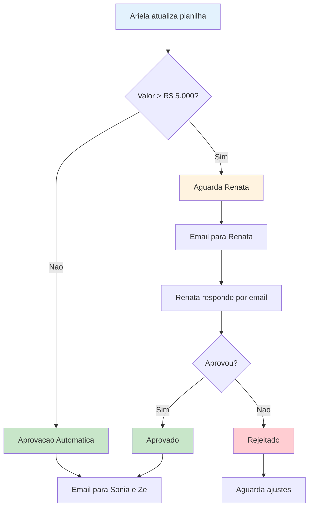
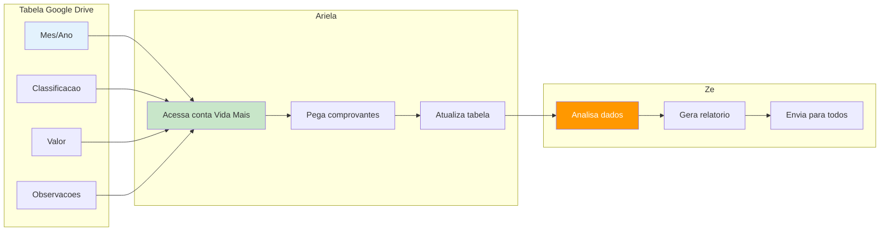
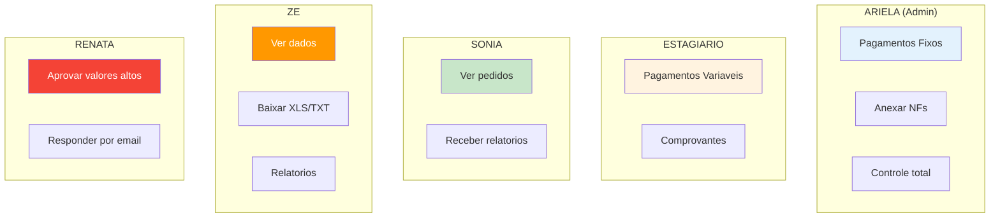
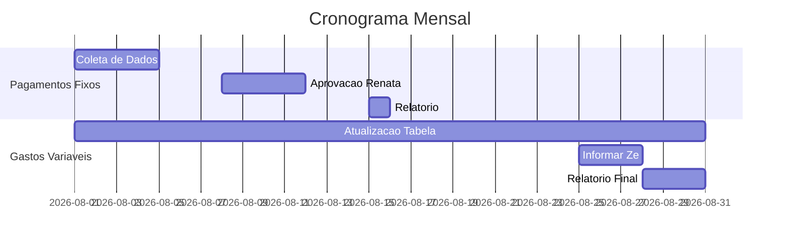
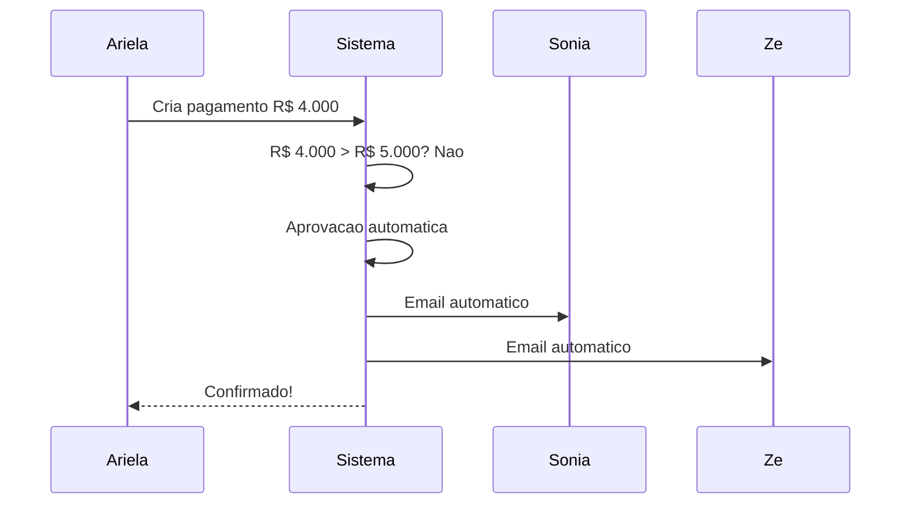
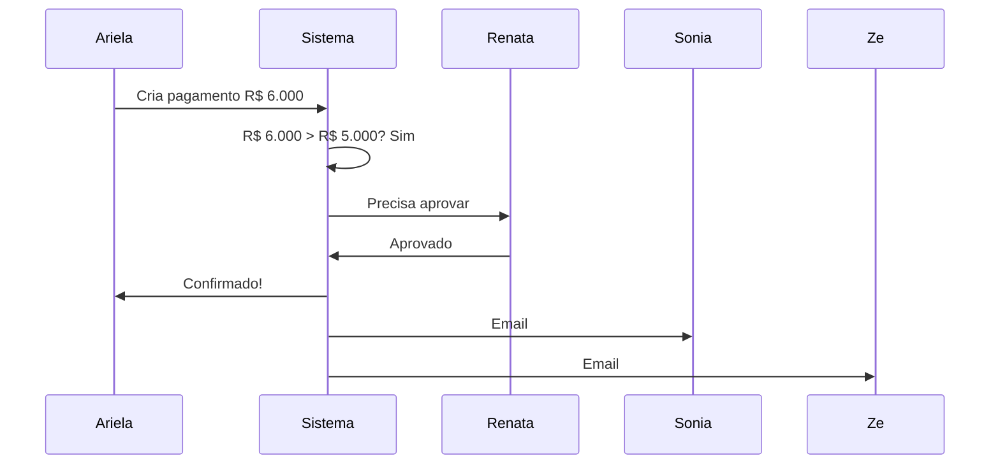

# 🎯 **Sistema Vida Mais - Como Funciona**

## 📅 **Contexto**
**Reunião**: 7 de agosto de 2025  
**Participantes**: Aldemar, Nathalia, Emanuel e Ariela  
**Prazo**: Semana de 22/08

---

## 🚀 **1. Pagamentos Fixos - Fluxo Principal**

### **O que é:**
- **Funcionários**: Salários mensais
- **Aluguel**: Escritório e depósito  
- **Bolsas**: Benefícios educacionais
- **Reembolsos**: Lanches, transporte (valores baixos)

### **Como Funciona:**

---

## 🔄 **2. Gastos Variáveis - Google Drive**

### **O que é:**
- Gastos que mudam todo mês
- Alimentação, transporte, material, manutenção

### **Como Funciona:**

---

## 👥 **3. Níveis de Acesso**

---

## 📧 **4. Comunicação por Email**

### **📅 Relatórios Automáticos:**
- **Dia 15**: Pagamentos fixos → Sonia e Zé
- **Dia 30**: Gastos variáveis → Todos

### **💰 Aprovações:**
- Sistema identifica pagamentos > R$ 5.000
- Envia email para Renata
- Renata responde por email
- Sistema confirma para Ariela

---

## 📅 **5. Cronograma Mensal**

---

## 🔄 **6. Exemplos Práticos**

### **Cenário 1: Salário R$ 4.000**

### **Cenário 2: Aluguel R$ 6.000**

---

## 🎯 **7. Resumo - Como Funciona**

### **📅 Todo Mês (Pagamentos Fixos):**
1. **Ariela** coloca na planilha
2. **Sistema** identifica aprovações
3. **Renata** responde por email
4. **Sistema** envia relatório

### **📊 Durante o Mês (Variáveis):**
1. **Ariela/Estagiário** atualiza tabela
2. **Ariela** pega comprovantes
3. **Zé** gera relatório
4. **Sistema** envia para todos

### **🔐 Acesso:**
- **Ariela**: Tudo
- **Estagiário**: Só variáveis
- **Sonia**: Ver + relatórios
- **Zé**: Ver + baixar + relatórios
- **Renata**: Aprovar valores altos

---

## 🎉 **Conclusão**

✅ **Pagamentos Fixos**: Planilha Excel + Renata por email + relatório mensal  
✅ **Gastos Variáveis**: Google Drive + comprovantes + Zé faz relatório  
✅ **Aprovações**: Renata responde por email  
✅ **Relatórios**: Automáticos mensais + manuais por Zé  
✅ **Acesso**: Cada um faz o que precisa  
✅ **Comunicação**: Email para tudo (como hoje)  

**🎯 Resultado**: Sistema que digitaliza o que já funciona, sem complicar!

---

## ❓ **Perguntas Frequentes**

**Q: Renata precisa entrar no sistema?**  
A: Não! Só responde por email.

**Q: Como fica a planilha Excel?**  
A: Continua igual! Sistema só organiza melhor.

**Q: E se Renata não responder?**  
A: Sistema envia lembretes automáticos.

**Q: Posso continuar usando Google Drive?**  
A: Sim! Sistema integra com o que já usa.
