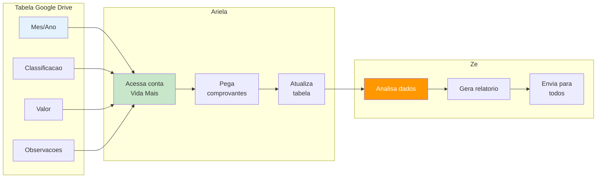
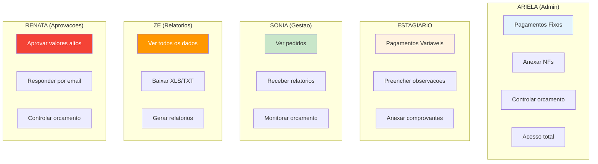
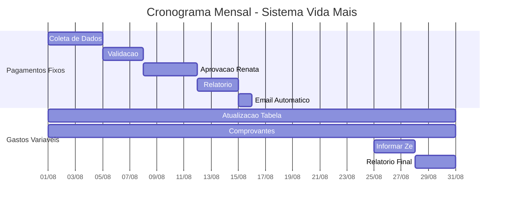
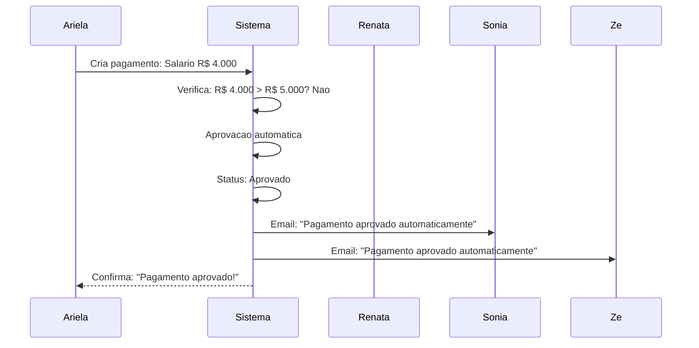
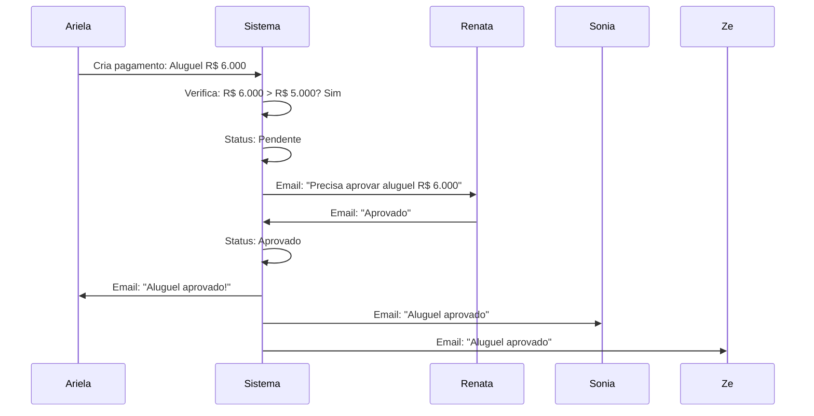

# Como Funciona o Sistema Vida Mais - Baseado na Reunião Real

## 📅 **Contexto da Reunião**
**Data**: Quinta-feira, 7 de agosto de 2025  
**Participantes**: Aldemar, Nathalia, Emanuel e Ariela (vida+)  
**Prazo de Resposta**: Semana do dia 22/08 (terceira semana de agosto)

---

## 🎯 **1. Pagamentos Mensais Fixos - Como Funciona**

### **📊 O que é:**
- **Funcionários**: Salários mensais
- **Aluguel**: Escritório e depósito
- **Bolsas de Estudo**: Benefícios educacionais
- **Reembolsos**: Lanches, transporte (valores baixos)

### **🔄 Como Funciona:**
```mermaid
flowchart TD
    A[Ariela atualiza<br/>planilha Excel] --> B{Valor > R$ 5.000?}
    
    B -->|Nao| C[Aprovacao Automatica]
    B -->|Sim| D[Aguarda Renata]
    
    C --> E[Email automatico<br/>para Sonia e Ze]
    
    D --> F[Email para Renata<br/>"Precisa aprovar"]
    F --> G[Renata analisa<br/>e responde por email]
    
    G --> H{Aprovou?}
    H -->|Sim| I[Pagamento aprovado]
    H -->|Nao| J[Pagamento rejeitado]
    
    I --> E
    J --> K[Registra rejeicao<br/>Aguarda ajustes]
    
    style A fill:#e3f2fd
    style C fill:#c8e6c9
    style D fill:#fff3e0
    style I fill:#c8e6c9
    style J fill:#ffcdd2
    style E fill:#e8f5e8
```

### **📋 Exemplo da Planilha:**
```
MÊS: AGOSTO 2025
┌─────────────────┬──────────┬──────────┬─────────────┐
│ ITEM            │ VALOR    │ TIPO     │ APROVAÇÃO   │
├─────────────────┼──────────┼──────────┼─────────────┤
│ João Silva      │ R$ 3.500 │ Salário  │ Renata      │
│ Maria Santos    │ R$ 2.800 │ Salário  │ Renata      │
│ Aluguel Escrit. │ R$ 2.500 │ Aluguel  │ Renata      │
│ Lanches         │ R$ 150   │ Reembolso│ Automática  │
│ Transporte      │ R$ 200   │ Reembolso│ Automática  │
└─────────────────┴──────────┴──────────┴─────────────┘
TOTAL: R$ 9.150
```

---

## 🔄 **2. Gastos Variáveis - Como Funciona**

### **📊 O que é:**
- Gastos que mudam todo mês
- Alimentação, transporte, material de escritório
- Manutenção, comunicação, outros

### **🔄 Como Funciona:**


### **📋 Exemplo da Tabela:**
```
MÊS: AGOSTO 2025
┌──────────┬──────────────┬──────────┬─────────────────┐
│ DATA     │ CLASSIFICAÇÃO│ VALOR    │ OBSERVAÇÕES     │
├──────────┼──────────────┼──────────┼─────────────────┤
│ 05/08    │ Alimentação  │ R$ 80    │ Lanche equipe   │
│ 12/08    │ Transporte   │ R$ 120   │ Uber reunião    │
│ 18/08    │ Material     │ R$ 45    │ Papel impressão │
│ 25/08    │ Manutenção   │ R$ 200   │ Ar condicionado │
└──────────┴──────────────┴──────────┴─────────────────┘
TOTAL: R$ 445
```

---

## 👥 **3. Quem Pode Fazer o Quê - Níveis de Acesso**



---

## 📧 **4. Como Funciona a Comunicação por Email**

### **📅 Relatórios Mensais (Automáticos):**
- **Dia 15**: Sistema envia relatório de pagamentos fixos para Sonia e Zé
- **Dia 30**: Sistema envia relatório de gastos variáveis para todos

### **💰 Aprovações (Renata):**
- Sistema identifica pagamentos que precisam de aprovação
- Envia email para Renata: "Precisa aprovar pagamento de R$ X"
- Renata responde por email: "Aprovado" ou "Rejeitado"
- Sistema confirma para Ariela e atualiza status

### **📊 Relatórios Variáveis (Zé):**
- Ariela informa Zé sobre gastos variáveis
- Zé gera relatório no sistema
- Sistema envia para Sonia e cópia para Zé

---

## 📅 **5. Cronograma Mensal - Quando Acontece**



---

## 🔄 **6. Exemplo Prático - Como Funciona na Prática**

### **📝 Cenário: Ariela quer pagar salário de R$ 4.000**



### **📝 Cenário: Ariela quer pagar aluguel de R$ 6.000**



---

## 🎯 **7. Resumo Simples - Como Funciona**

### **📅 Todo Mês (Pagamentos Fixos):**
1. **Ariela** coloca pagamentos na planilha
2. **Sistema** identifica o que precisa de aprovação
3. **Renata** recebe email e responde por email
4. **Sistema** envia relatório para Sonia e Zé

### **📊 Durante o Mês (Gastos Variáveis):**
1. **Ariela/Estagiário** coloca gastos na tabela
2. **Ariela** pega comprovantes da conta
3. **Zé** gera relatório
4. **Sistema** envia para todos

### **🔐 Quem Pode Fazer o Quê:**
- **Ariela**: Tudo (fixos + variáveis + NFs)
- **Estagiário**: Só variáveis
- **Sonia**: Ver + receber relatórios
- **Zé**: Ver + baixar + relatórios
- **Renata**: Aprovar valores altos

---

## 🎉 **Conclusão - Sistema Simples e Prático**

O sistema funciona **exatamente** como na reunião:

✅ **Pagamentos Fixos**: Planilha Excel + Renata aprova por email + relatório mensal  
✅ **Gastos Variáveis**: Tabela Google Drive + comprovantes + Zé faz relatório  
✅ **Aprovações**: Renata responde por email (valores altos)  
✅ **Relatórios**: Automáticos mensais + manuais por Zé  
✅ **Acesso**: Cada um pode fazer o que precisa  
✅ **Comunicação**: Email para tudo (como funciona hoje)  

**🎯 Resultado**: Sistema que digitaliza o que já funciona, sem complicar! 🚀

---

## ❓ **Perguntas Frequentes**

**Q: Renata precisa entrar no sistema?**  
A: Não! Ela só responde por email, como funciona hoje.

**Q: Como fica a planilha Excel?**  
A: Continua igual! O sistema só organiza melhor.

**Q: E se Renata não responder?**  
A: Sistema envia lembretes automáticos.

**Q: Posso continuar usando Google Drive?**  
A: Sim! O sistema integra com o que já usa.
