# Como Funciona o Sistema Vida Mais - Baseado na Reunião Real

## 📅 **Contexto da Reunião**
**Data**: Quinta-feira, 7 de agosto de 2025  
**Participantes**: Aldemar, Nathalia, Emanuel e Ariela (vida+)  
**Prazo de Resposta**: Semana do dia 22/08 (terceira semana de agosto)

---

## 🎯 **1. Pagamentos Mensais Fixos - Como Funciona**

### **📊 O que é:**
- **Funcionários**: Salários mensais
- **Aluguel**: Escritório e depósito
- **Bolsas de Estudo**: Benefícios educacionais
- **Reembolsos**: Lanches, transporte (valores baixos)

### **🔄 Como Funciona:**
```mermaid
flowchart TD
    A[📊 Ariela atualiza<br/>planilha Excel] --> B{💰 Valor > R$ 5.000?}
    
    B -->|❌ Não (lanches, reembolsos)| C[✅ Aprovação Automática]
    B -->|✅ Sim (salários, aluguel)| D[⏳ Aguarda Renata]
    
    C --> E[📧 Email automático<br/>para Sonia e Zé]
    
    D --> F[📧 Email para Renata<br/>"Precisa aprovar"]
    F --> G[👩‍💼 Renata analisa<br/>e responde por email]
    
    G --> H{🔍 Aprovou?}
    H -->|✅ Sim| I[✅ Pagamento aprovado]
    H -->|❌ Não| J[❌ Pagamento rejeitado]
    
    I --> E
    J --> K[📝 Registra rejeição<br/>Aguarda ajustes]
    
    style A fill:#e3f2fd
    style C fill:#c8e6c9
    style D fill:#fff3e0
    style I fill:#c8e6c9
    style J fill:#ffcdd2
    style E fill:#e8f5e8
```

### **📋 Exemplo da Planilha:**
```
MÊS: AGOSTO 2025
┌─────────────────┬──────────┬──────────┬─────────────┐
│ ITEM            │ VALOR    │ TIPO     │ APROVAÇÃO   │
├─────────────────┼──────────┼──────────┼─────────────┤
│ João Silva      │ R$ 3.500 │ Salário  │ Renata      │
│ Maria Santos    │ R$ 2.800 │ Salário  │ Renata      │
│ Aluguel Escrit. │ R$ 2.500 │ Aluguel  │ Renata      │
│ Lanches         │ R$ 150   │ Reembolso│ Automática  │
│ Transporte      │ R$ 200   │ Reembolso│ Automática  │
└─────────────────┴──────────┴──────────┴─────────────┘
TOTAL: R$ 9.150
```

---

## 🔄 **2. Gastos Variáveis - Como Funciona**

### **📊 O que é:**
- Gastos que mudam todo mês
- Alimentação, transporte, material de escritório
- Manutenção, comunicação, outros

### **🔄 Como Funciona:**


```mermaid
flowchart LR
    subgraph "📊 Tabela Google Drive"
        A[📅 Mês/Ano]
        B[🏷️ Classificação]
        C[💰 Valor]
        D[📝 Observações]
    end
    
    subgraph "👩‍💼 Ariela"
        E[💳 Acessa conta<br/>Vida Mais]
        F[📱 Pega<br/>comprovantes]
        G[📊 Atualiza<br/>tabela]
    end
    
    subgraph "👨‍💼 Zé"
        H[📊 Analisa dados]
        I[📈 Gera relatório]
        J[📧 Envia para<br/>todos]
    end
    
    A --> E
    B --> E
    C --> E
    D --> E
    
    E --> F --> G
    G --> H --> I --> J
    
    style A fill:#e3f2fd
    style E fill:#c8e6c9
    style H fill:#ff9800,color:#fff
```

### **📋 Exemplo da Tabela:**
```
MÊS: AGOSTO 2025
┌──────────┬──────────────┬──────────┬─────────────────┐
│ DATA     │ CLASSIFICAÇÃO│ VALOR    │ OBSERVAÇÕES     │
├──────────┼──────────────┼──────────┼─────────────────┤
│ 05/08    │ Alimentação  │ R$ 80    │ Lanche equipe   │
│ 12/08    │ Transporte   │ R$ 120   │ Uber reunião    │
│ 18/08    │ Material     │ R$ 45    │ Papel impressão │
│ 25/08    │ Manutenção   │ R$ 200   │ Ar condicionado │
└──────────┴──────────────┴──────────┴─────────────────┘
TOTAL: R$ 445
```

---

## 👥 **3. Quem Pode Fazer o Quê - Níveis de Acesso**

```mermaid
graph TB
    subgraph "👩‍💼 ARIELA (Admin)"
        A[💳 Pagamentos Fixos]
        B[📎 Anexar NFs]
        C[💰 Controlar orçamento]
        D[📊 Acesso total]
    end
    
    subgraph "👨‍🎓 ESTAGIÁRIO"
        E[💸 Pagamentos Variáveis]
        F[📝 Preencher observações]
        G[📎 Anexar comprovantes]
    end
    
    subgraph "👩‍💼 SONIA (Gestão)"
        I[📊 Ver pedidos]
        J[📧 Receber relatórios]
        K[💰 Monitorar orçamento]
    end
    
    subgraph "👨‍💼 ZÉ (Relatórios)"
        M[📊 Ver todos os dados]
        N[💾 Baixar XLS/TXT]
        O[📈 Gerar relatórios]
    end
    
    subgraph "👩‍💼 RENATA (Aprovações)"
        Q[✅ Aprovar valores altos]
        R[📧 Responder por email]
        S[💰 Controlar orçamento]
    end
    
    style A fill:#e3f2fd
    style E fill:#fff3e0
    style I fill:#c8e6c9
    style M fill:#ff9800,color:#fff
    style Q fill:#f44336,color:#fff
```



---

## 📧 **4. Como Funciona a Comunicação por Email**

### **📅 Relatórios Mensais (Automáticos):**
- **Dia 15**: Sistema envia relatório de pagamentos fixos para Sonia e Zé
- **Dia 30**: Sistema envia relatório de gastos variáveis para todos

### **💰 Aprovações (Renata):**
- Sistema identifica pagamentos que precisam de aprovação
- Envia email para Renata: "Precisa aprovar pagamento de R$ X"
- Renata responde por email: "Aprovado" ou "Rejeitado"
- Sistema confirma para Ariela e atualiza status

### **📊 Relatórios Variáveis (Zé):**
- Ariela informa Zé sobre gastos variáveis
- Zé gera relatório no sistema
- Sistema envia para Sonia e cópia para Zé

---

## 📅 **5. Cronograma Mensal - Quando Acontece**

```mermaid
gantt
    title 📅 Cronograma Mensal - Sistema Vida Mais
    dateFormat  DD/MM
    axisFormat %d/%m
    
    section 📊 Pagamentos Fixos
    Coleta de Dados        :01/08, 05/08
    Validação              :05/08, 08/08
    Aprovação Renata       :08/08, 12/08
    Relatório              :12/08, 15/08
    Email Automático       :15/08, 16/08
    
    section 💸 Gastos Variáveis
    Atualização Tabela     :01/08, 31/08
    Comprovantes           :01/08, 31/08
    Informar Zé            :25/08, 28/08
    Relatório Final        :28/08, 31/08
```



---

## 🔄 **6. Exemplo Prático - Como Funciona na Prática**

### **📝 Cenário: Ariela quer pagar salário de R$ 4.000**

```mermaid
sequenceDiagram
    participant A as 👩‍💼 Ariela
    participant S as ⚙️ Sistema
    participant R as 👩‍💼 Renata
    participant S2 as 👩‍💼 Sonia
    participant Z as 👨‍💼 Zé

    A->>S: 💰 Cria pagamento: Salário R$ 4.000
    S->>S: 🔍 Verifica: R$ 4.000 > R$ 5.000? ❌
    S->>S: ✅ Aprovação automática
    S->>S: 📝 Status: Aprovado
    S->>S2: 📧 Email: "Pagamento aprovado automaticamente"
    S->>Z: 📧 Email: "Pagamento aprovado automaticamente"
    S-->>A: ✅ Confirma: "Pagamento aprovado!"
```



### **📝 Cenário: Ariela quer pagar aluguel de R$ 6.000**

```mermaid
sequenceDiagram
    participant A as 👩‍💼 Ariela
    participant S as ⚙️ Sistema
    participant R as 👩‍💼 Renata
    participant S2 as 👩‍💼 Sonia
    participant Z as 👨‍💼 Zé

    A->>S: 💰 Cria pagamento: Aluguel R$ 6.000
    S->>S: 🔍 Verifica: R$ 6.000 > R$ 5.000? ✅
    S->>S: ⏳ Status: Pendente
    S->>R: 📧 Email: "Precisa aprovar aluguel R$ 6.000"
    R->>S: 📧 Email: "Aprovado"
    S->>S: ✅ Status: Aprovado
    S->>A: 📧 Email: "Aluguel aprovado!"
    S->>S2: 📧 Email: "Aluguel aprovado"
    S->>Z: 📧 Email: "Aluguel aprovado"
```



---

## 🎯 **7. Resumo Simples - Como Funciona**

### **📅 Todo Mês (Pagamentos Fixos):**
1. **Ariela** coloca pagamentos na planilha
2. **Sistema** identifica o que precisa de aprovação
3. **Renata** recebe email e responde por email
4. **Sistema** envia relatório para Sonia e Zé

### **📊 Durante o Mês (Gastos Variáveis):**
1. **Ariela/Estagiário** coloca gastos na tabela
2. **Ariela** pega comprovantes da conta
3. **Zé** gera relatório
4. **Sistema** envia para todos

### **🔐 Quem Pode Fazer o Quê:**
- **Ariela**: Tudo (fixos + variáveis + NFs)
- **Estagiário**: Só variáveis
- **Sonia**: Ver + receber relatórios
- **Zé**: Ver + baixar + relatórios
- **Renata**: Aprovar valores altos

---

## 🎉 **Conclusão - Sistema Simples e Prático**

O sistema funciona **exatamente** como na reunião:

✅ **Pagamentos Fixos**: Planilha Excel + Renata aprova por email + relatório mensal  
✅ **Gastos Variáveis**: Tabela Google Drive + comprovantes + Zé faz relatório  
✅ **Aprovações**: Renata responde por email (valores altos)  
✅ **Relatórios**: Automáticos mensais + manuais por Zé  
✅ **Acesso**: Cada um pode fazer o que precisa  
✅ **Comunicação**: Email para tudo (como funciona hoje)  

**🎯 Resultado**: Sistema que digitaliza o que já funciona, sem complicar! 🚀

---

## ❓ **Perguntas Frequentes**

**Q: Renata precisa entrar no sistema?**  
A: Não! Ela só responde por email, como funciona hoje.

**Q: Como fica a planilha Excel?**  
A: Continua igual! O sistema só organiza melhor.

**Q: E se Renata não responder?**  
A: Sistema envia lembretes automáticos.

**Q: Posso continuar usando Google Drive?**  
A: Sim! O sistema integra com o que já usa.
