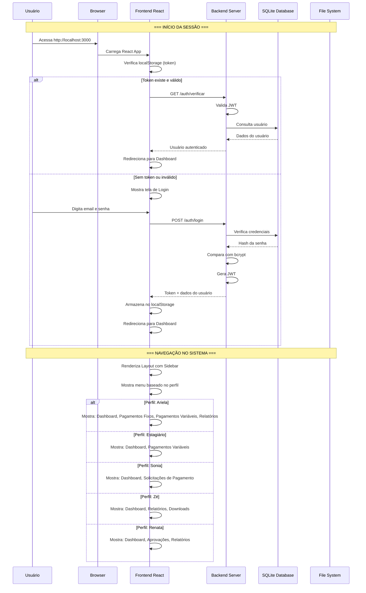
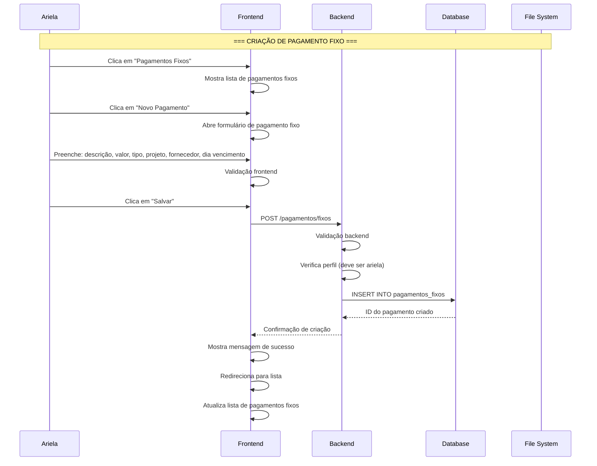
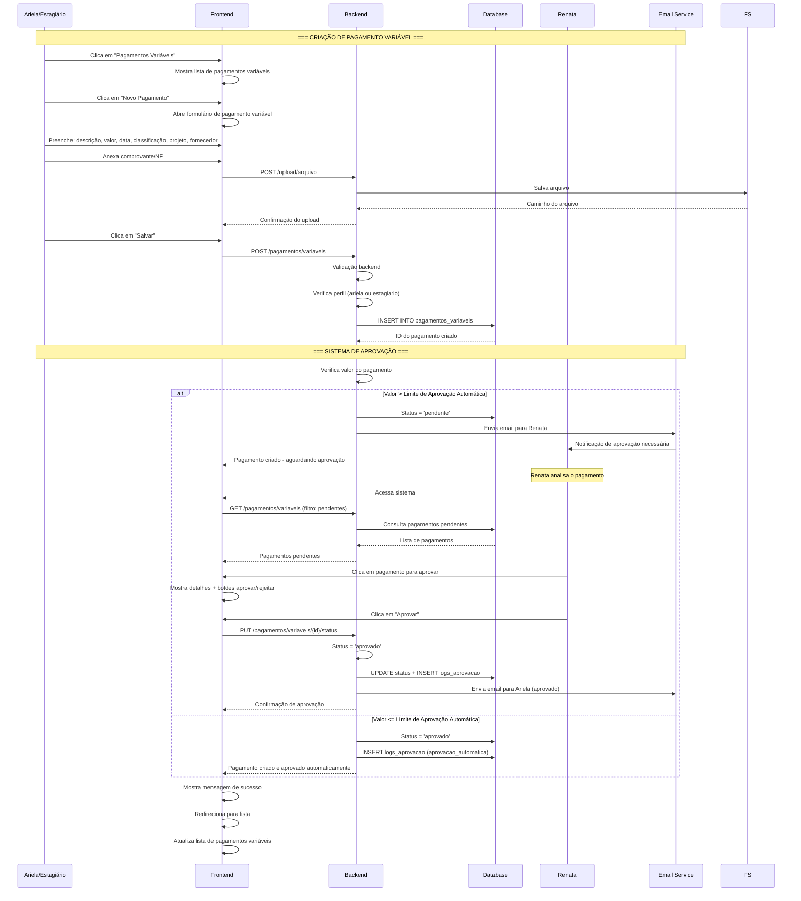
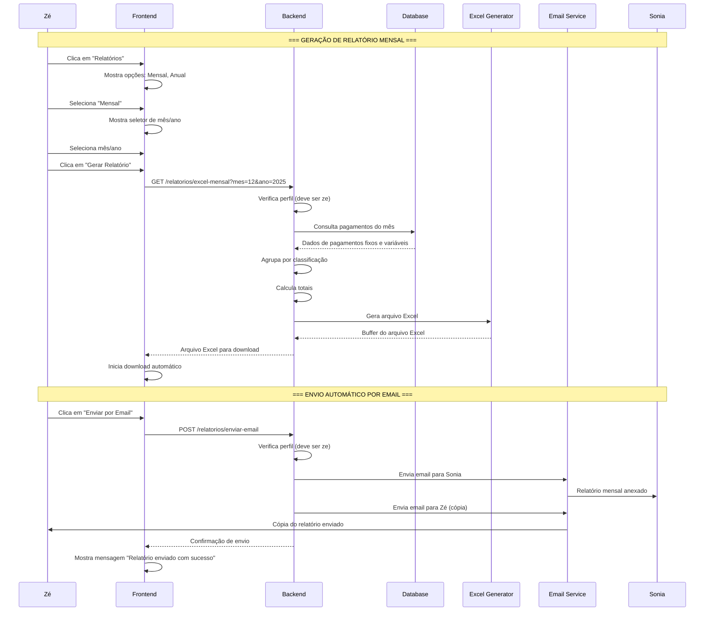
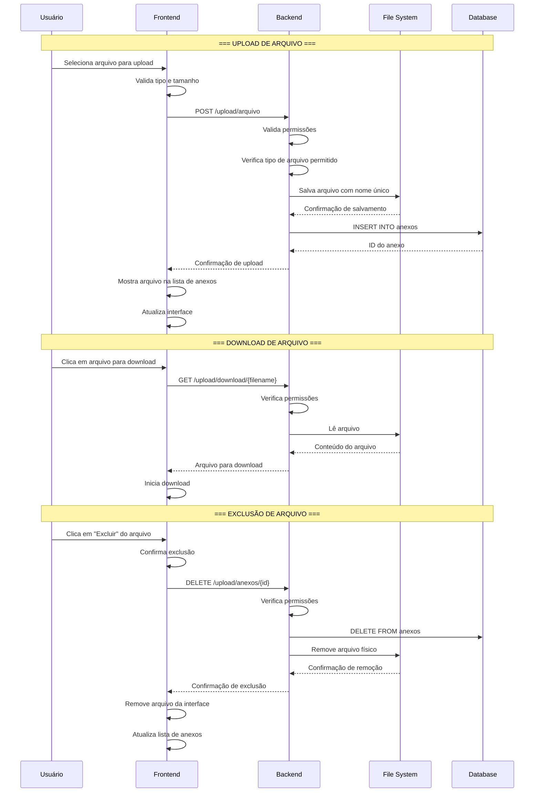
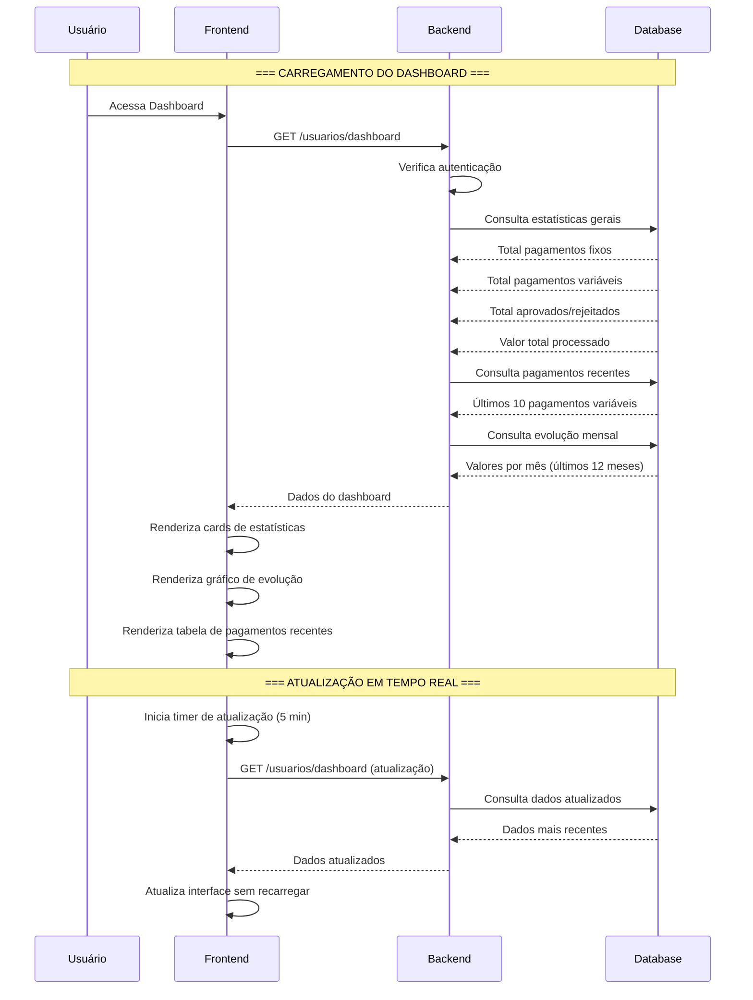
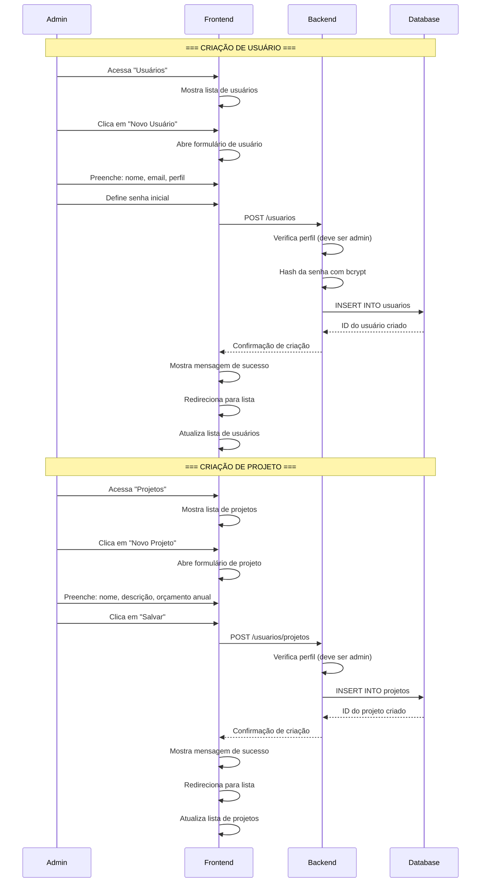
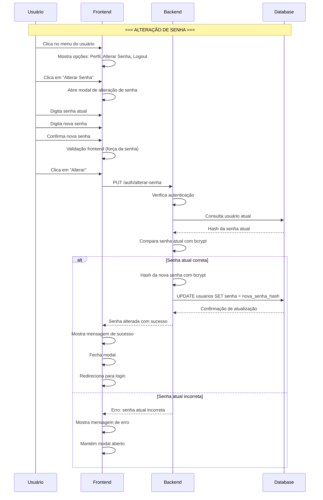
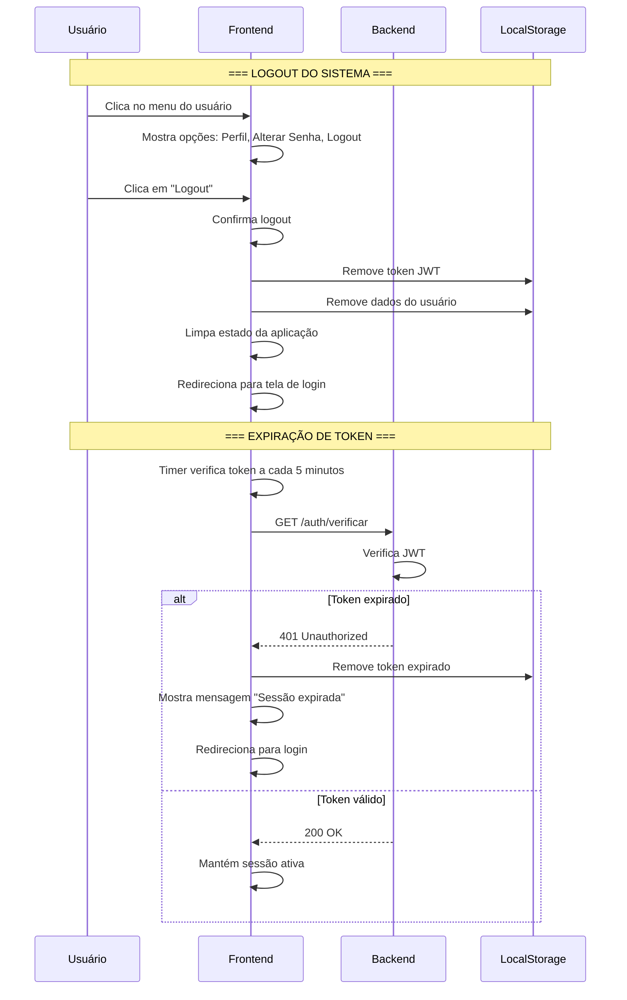
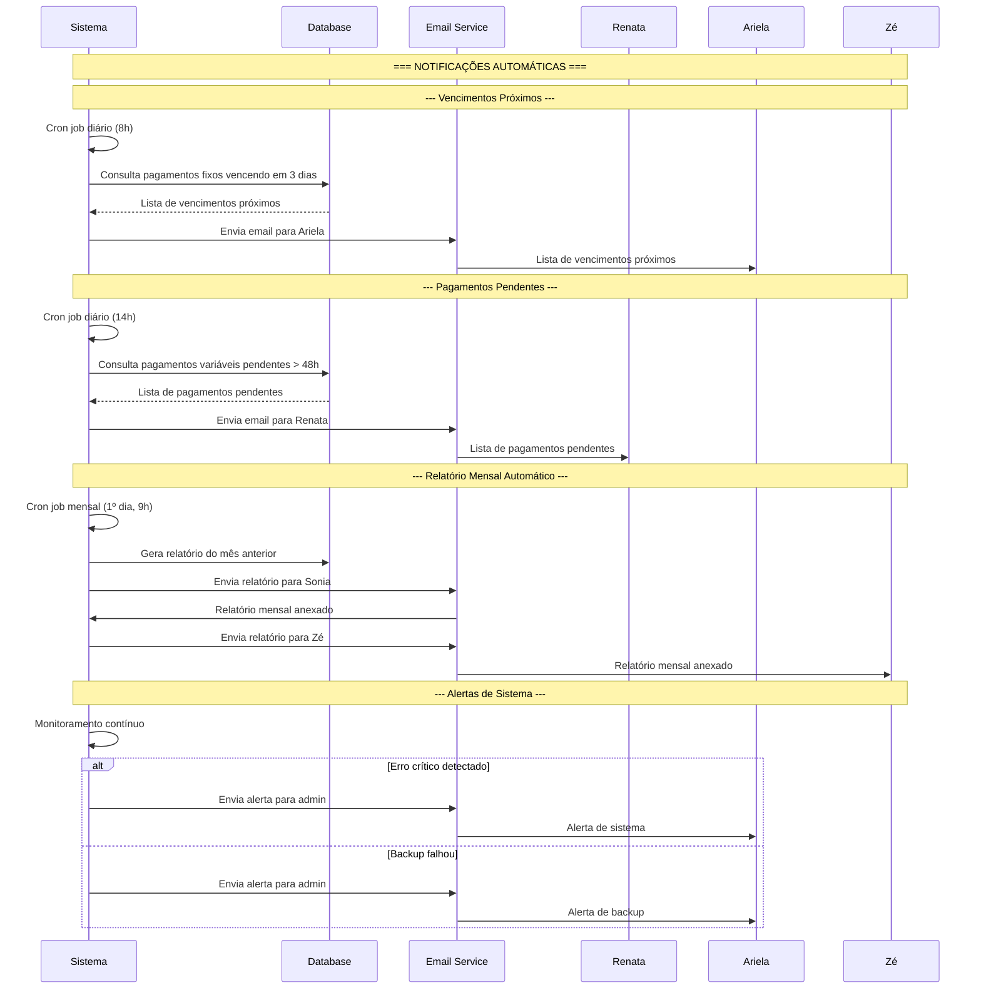

# Fluxo Sequencial do Sistema - Vida Mais Pagamentos

## 1. Fluxo Completo de Autenticação e Navegação

## 2. Fluxo de Criação de Pagamento Fixo

## 3. Fluxo de Criação de Pagamento Variável com Aprovação

## 4. Fluxo de Geração e Envio de Relatórios

## 5. Fluxo de Upload e Gestão de Arquivos

## 6. Fluxo de Dashboard e Estatísticas

## 7. Fluxo de Gestão de Usuários e Projetos

## 8. Fluxo de Alteração de Senha

## 9. Fluxo de Logout e Fim de Sessão

## 10. Fluxo de Notificações e Alertas

## Resumo dos Fluxos Principais

### 🔐 **Autenticação e Sessão**
1. Usuário acessa sistema
2. Verificação de token existente
3. Login com credenciais
4. Geração e armazenamento de JWT
5. Navegação baseada em perfil

### 💰 **Gestão de Pagamentos**
1. Criação de pagamentos (fixos/variáveis)
2. Upload de comprovantes
3. Sistema de aprovação automática/manual
4. Notificações por email
5. Logs de auditoria

### 📊 **Relatórios e Exportação**
1. Geração de relatórios Excel
2. Envio automático por email
3. Download direto de arquivos
4. Estatísticas em tempo real

### 👥 **Gestão de Usuários**
1. Controle de perfis e permissões
2. Criação e edição de usuários
3. Alteração de senhas
4. Gestão de projetos

### 🔔 **Notificações e Alertas**
1. Vencimentos próximos
2. Pagamentos pendentes
3. Relatórios automáticos
4. Alertas de sistema

### 📁 **Gestão de Arquivos**
1. Upload de múltiplos tipos
2. Organização por pagamento
3. Download e exclusão
4. Controle de versões
