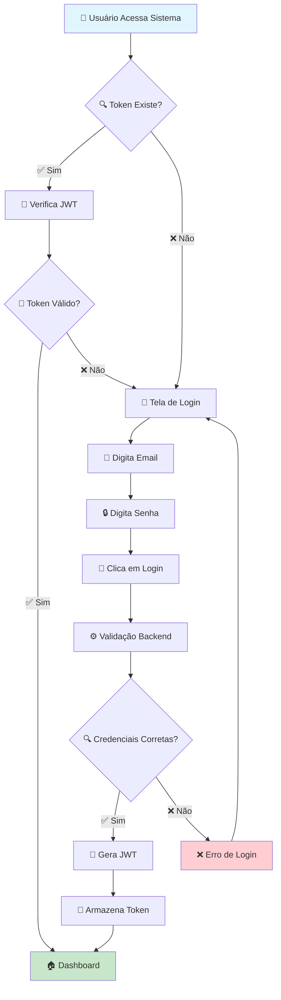
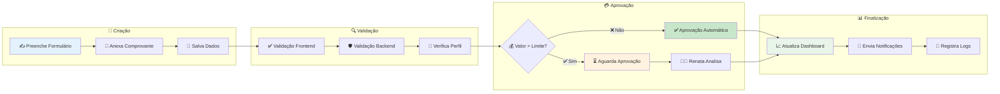
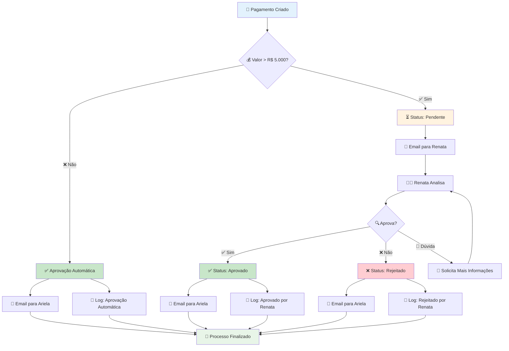
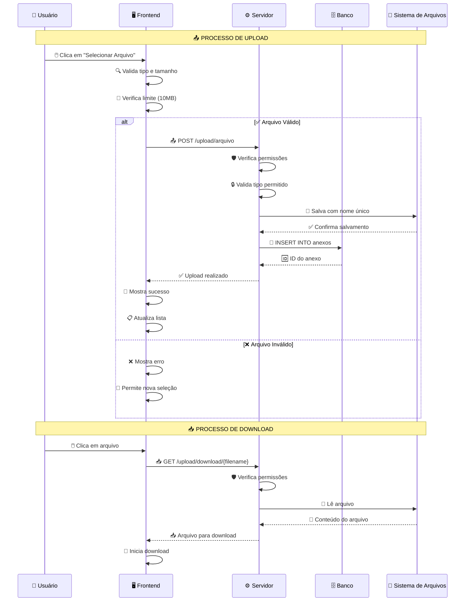
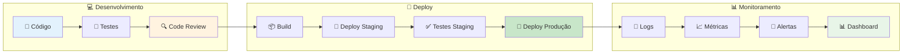
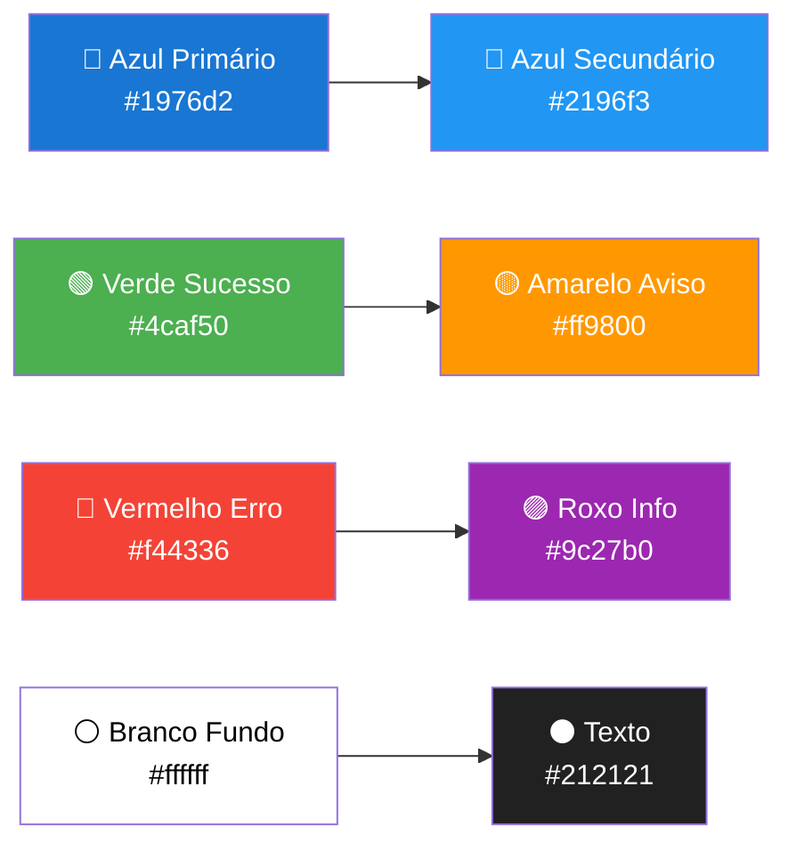
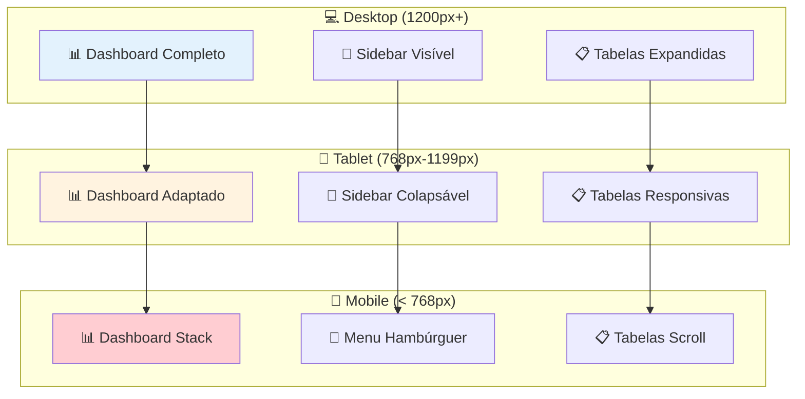

# Imagens e Diagramas Visuais - Sistema Vida Mais

## 🎨 **Visão Geral do Sistema - Diagrama de Arquitetura**

```mermaid
graph TB
    subgraph "🌐 Frontend (React + Material-UI)"
        A[📱 Interface do Usuário]
        B[🔐 Autenticação]
        C[📊 Dashboard]
        D[💰 Gestão de Pagamentos]
        E[📁 Upload de Arquivos]
        F[📈 Relatórios]
    end
    
    subgraph "⚙️ Backend (Node.js + Express)"
        G[🛡️ Middleware de Segurança]
        H[🔑 Autenticação JWT]
        I[📋 Validação de Dados]
        J[📧 Serviço de Email]
        K[📊 Geração de Relatórios]
        L[💾 Persistência de Dados]
    end
    
    subgraph "🗄️ Banco de Dados (SQLite)"
        M[👥 Usuários]
        N[📁 Projetos]
        O[💳 Pagamentos Fixos]
        P[💸 Pagamentos Variáveis]
        Q[📎 Anexos]
        R[📝 Logs de Aprovação]
    end
    
    subgraph "☁️ Serviços Externos"
        S[📧 Email (Gmail/SMTP)]
        T[💾 Backup Cloud]
        U[📱 Notificações]
    end
    
    A --> G
    B --> H
    C --> L
    D --> I
    E --> L
    F --> K
    
    G --> M
    H --> M
    I --> N
    J --> S
    K --> P
    L --> Q
    
    K --> S
    L --> T
    H --> U
```

## 🔐 **Fluxo de Login - Diagrama Visual**



## 💰 **Fluxo de Pagamentos - Workflow Visual**



## 📊 **Dashboard - Layout Visual**

```mermaid
graph TB
    subgraph "🎯 Cabeçalho"
        A[🏢 Vida Mais - Sistema de Pagamentos]
        B[👤 Menu do Usuário]
        C[🔔 Notificações]
    end
    
    subgraph "📱 Sidebar de Navegação"
        D[🏠 Dashboard]
        E[💳 Pagamentos Fixos]
        F[💸 Pagamentos Variáveis]
        G[📊 Relatórios]
        H[👥 Usuários]
        I[⚙️ Configurações]
    end
    
    subgraph "📊 Área Principal - Dashboard"
        J[💰 Total de Pagamentos]
        K[📈 Gráfico de Evolução]
        L[📋 Pagamentos Recentes]
        M[🚨 Alertas e Notificações]
    end
    
    subgraph "📊 Cards de Estatísticas"
        N[💵 R$ 125.000,00<br/>Total Processado]
        O[📅 45<br/>Pagamentos este Mês]
        P[⏳ 12<br/>Pendentes de Aprovação]
        Q[✅ 89%<br/>Taxa de Aprovação]
    end
    
    A --> B --> C
    D --> E --> F --> G --> H --> I
    J --> K --> L --> M
    N --> O --> P --> Q
    
    style A fill:#1976d2,color:#fff
    style D fill:#4caf50,color:#fff
    style J fill:#ff9800,color:#fff
    style N fill:#2196f3,color:#fff
    style O fill:#4caf50,color:#fff
    style P fill:#ff9800,color:#fff
    style Q fill:#9c27b0,color:#fff
```



## 🔄 **Sistema de Aprovação - Fluxograma**



## 📁 **Gestão de Arquivos - Diagrama de Upload**



## 📊 **Geração de Relatórios - Workflow Visual**

```mermaid
flowchart TD
    A[👨‍💼 Zé Acessa Relatórios] --> B{📊 Que Tipo?}
    
    B -->|📅 Mensal| C[📅 Seleciona Mês/Ano]
    B -->|📆 Anual| D[📆 Seleciona Ano]
    
    C --> E[🚀 Clica "Gerar Relatório"]
    D --> E
    
    E --> F[⚙️ Backend Processa]
    F --> G[🗄️ Consulta Banco de Dados]
    G --> H[📊 Agrupa por Classificação]
    H --> I[🧮 Calcula Totais]
    
    I --> J{📧 Enviar por Email?}
    J -->|✅ Sim| K[📧 Envia para Sonia]
    J -->|✅ Sim| L[📧 Envia para Zé]
    J -->|❌ Não| M[💾 Download Direto]
    
    K --> N[📝 Log de Envio]
    L --> N
    M --> O[📁 Arquivo Disponível]
    
    N --> P[🎉 Relatório Enviado]
    O --> P
    
    style A fill:#e3f2fd
    style E fill:#ff9800,color:#fff
    style K fill:#4caf50,color:#fff
    style L fill:#4caf50,color:#fff
    style M fill:#2196f3,color:#fff
    style P fill:#c8e6c9
```

## 🔔 **Sistema de Notificações - Timeline Visual**

```mermaid
gantt
    title 📅 Cronograma de Notificações Automáticas
    dateFormat  HH:mm
    axisFormat %H:%M
    
    section 🌅 Manhã (8h)
    Vencimentos Próximos    :08:00, 08:05
    Backup Diário          :08:30, 09:00
    
    section 🌞 Tarde (14h)
    Pagamentos Pendentes   :14:00, 14:05
    Verificação de Sistema :14:30, 15:00
    
    section 🌙 Noite (20h)
    Logs de Auditoria      :20:00, 20:10
    Limpeza de Arquivos    :20:30, 21:00
    
    section 📅 Mensal (1º dia)
    Relatório Mensal       :09:00, 10:00
    Backup Mensal          :10:30, 12:00
```



## 🎨 **Interface do Usuário - Mockup Visual**

```mermaid
graph TB
    subgraph "🖥️ Tela Principal"
        A[🏢 Header: Vida Mais]
        B[👤 Ariela Silva | Logout]
    end
    
    subgraph "📱 Menu Lateral"
        C[🏠 Dashboard]
        D[💳 Pagamentos Fixos]
        E[💸 Pagamentos Variáveis]
        F[📊 Relatórios]
        G[👥 Usuários]
    end
    
    subgraph "📊 Área de Conteúdo"
        H[💰 Total: R$ 125.000,00]
        I[📈 Gráfico de Barras]
        J[📋 Tabela de Pagamentos]
        K[🚨 3 Pagamentos Pendentes]
    end
    
    subgraph "🔔 Notificações"
        L[📧 2 emails não lidos]
        M[⏰ 5 vencimentos próximos]
        N[✅ 12 aprovados hoje]
    end
    
    A --> B
    C --> D --> E --> F --> G
    H --> I --> J --> K
    L --> M --> N
    
    style A fill:#1976d2,color:#fff
    style C fill:#4caf50,color:#fff
    style H fill:#ff9800,color:#fff
    style L fill:#f44336,color:#fff
```

## 🚀 **Fluxo de Desenvolvimento - Pipeline Visual**



## 🎯 **Resumo Visual dos Fluxos**

### 🔐 **Autenticação**
```
👤 Usuário → 🌐 Sistema → 🔑 JWT → 🏠 Dashboard
```

### 💰 **Pagamentos**
```
📝 Formulário → ✅ Validação → 💳 Aprovação → 📊 Registro
```

### 📊 **Relatórios**
```
📅 Seleção → 🗄️ Consulta → 📊 Processamento → 📧 Envio/💾 Download
```

### 🔔 **Notificações**
```
⏰ Cron Job → 📧 Email → 👤 Destinatário → 📝 Log
```

### 📁 **Arquivos**
```
📤 Upload → 💾 Armazenamento → 📥 Download → 🗑️ Exclusão
```

## 🎨 **Paleta de Cores do Sistema**



## 📱 **Responsividade - Breakpoints Visuais**



## 🎉 **Conclusão Visual**

O sistema Vida Mais é uma **solução completa e integrada** que oferece:

- 🔐 **Segurança robusta** com JWT e RBAC
- 💰 **Gestão eficiente** de pagamentos fixos e variáveis
- 📊 **Relatórios automáticos** com Excel e email
- 📁 **Gestão de arquivos** com upload/download
- 🔔 **Notificações inteligentes** baseadas em cron jobs
- 📱 **Interface responsiva** para todos os dispositivos
- 🚀 **Arquitetura escalável** para crescimento futuro

**🎯 Resultado**: Sistema profissional que atende todas as necessidades da Vida Mais com **usabilidade**, **segurança** e **eficiência**! 🚀
